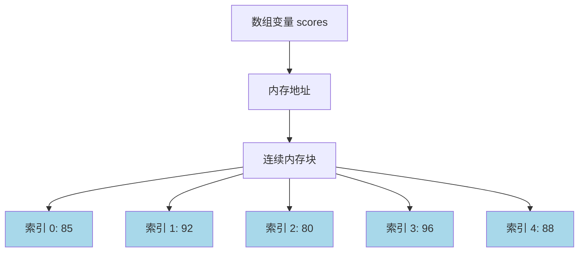
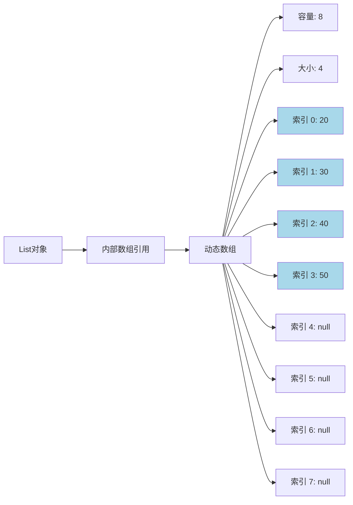

# C#数组全面解析


**本文收录于《控制工程自学指南》上位机篇，© 2025 SAJalon**

---

## 前言

数组是编程中最基础也是最重要的数据结构之一。在C#中，数组分为固定大小的不可变数组和动态大小的可变数组。本文将全面梳理C#中各种数组类型的特点、使用方法和底层原理。

## 什么是数组？

**数组**是一种线性数据结构，用于存储相同类型的数据元素。数组中的每个元素都有一个索引（下标），通过索引可以快速访问数组中的任意元素。

### 数组的基本概念

*   **索引（Index）**：数组中元素的位置标识，从0开始计数
    
*   **长度（Length）**：数组中元素的总个数
    
*   **元素（Element）**：数组中的每个数据项
    
*   **固定大小**：数组创建时确定大小，之后不能改变（针对不可变数组）
    
*   **动态大小**：数组大小可以动态调整（针对可变数组）
    

## 一、不可变数组（Fixed-size Arrays）

不可变数组是指在创建时就确定大小，在整个生命周期中大小不能改变的数组。

### 1.1 基本语法和声明

```csharp
// 声明并初始化数组的不同方式

int[ ] numbers1 = new int[5];           // 创建长度为5的整数数组，所有元素初始化为0


int[ ] numbers2 = new int[ ] {1, 2, 3, 4, 5};  // 创建并初始化数组


int[ ] numbers3 = {1, 2, 3, 4, 5};      // 简化的初始化方式


string[ ] names = new string[3];        // 字符串数组


```

### 1.2 数组的基本操作

```csharp
using System;

class Program
{
    static void Main()
    {
        // 创建一个整数数组

        int[ ] scores = new int[ ] { 85, 92, 78, 96, 88 };

        
        // 访问数组元素
        Console.WriteLine($"第一个分数: {scores[0]}");  // 输出: 85
        Console.WriteLine($"最后一个分数: {scores[4]}"); // 输出: 88
        
        // 修改数组元素
        scores[2] = 80;
        Console.WriteLine($"修改后的第三个分数: {scores[2]}"); // 输出: 80
        
        // 获取数组长度
        Console.WriteLine($"数组长度: {scores.Length}"); // 输出: 5
        
        // 遍历数组
        Console.WriteLine("所有分数:");
        for (int i = 0; i < scores.Length; i++)
        {
            Console.WriteLine($"索引 {i}: {scores[i]}");
        }
        // 输出:
        // 索引 0: 85
        // 索引 1: 92
        // 索引 2: 80
        // 索引 3: 96
        // 索引 4: 88
    }
}

```

### 1.3 不可变数组的内存结构



### 1.4 多维数组

```csharp
using System;

class Program
{
    static void Main()
    {
        // 二维数组 - 矩阵
        int[,] matrix = new int[3, 4]
        {
            {1, 2, 3, 4},
            {5, 6, 7, 8},
            {9, 10, 11, 12}
        };
        
        Console.WriteLine($"矩阵行数: {matrix.GetLength(0)}"); // 输出: 3
        Console.WriteLine($"矩阵列数: {matrix.GetLength(1)}"); // 输出: 4
        Console.WriteLine($"matrix[1,2] = {matrix[1, 2]}");    // 输出: 7
        
        // 遍历二维数组
        Console.WriteLine("矩阵内容:");
        for (int i = 0; i < matrix.GetLength(0); i++)
        {
            for (int j = 0; j < matrix.GetLength(1); j++)
            {
                Console.Write($"{matrix[i, j]}\t");
            }
            Console.WriteLine();
        }
        // 输出:
        // 1    2    3    4
        // 5    6    7    8
        // 9    10   11   12
    }
}

```

### 1.5 交错数组（Jagged Array）

```csharp
using System;

class Program
{
    static void Main()
    {
        // 交错数组 - 数组的数组

        int[ ][ ] jaggedArray = new int[3][ ];


        jaggedArray[0] = new int[ ] { 1, 2, 3 };


        jaggedArray[1] = new int[ ] { 4, 5 };


        jaggedArray[2] = new int[ ] { 6, 7, 8, 9, 10 };

        
        Console.WriteLine($"第一行长度: {jaggedArray[0].Length}"); // 输出: 3
        Console.WriteLine($"第二行长度: {jaggedArray[1].Length}"); // 输出: 2
        Console.WriteLine($"第三行长度: {jaggedArray[2].Length}"); // 输出: 5
        
        // 遍历交错数组
        Console.WriteLine("交错数组内容:");
        for (int i = 0; i < jaggedArray.Length; i++)
        {
            Console.Write($"第{i}行: ");
            for (int j = 0; j < jaggedArray[i].Length; j++)
            {
                Console.Write($"{jaggedArray[i][j]} ");
            }
            Console.WriteLine();
        }
        // 输出:
        // 第0行: 1 2 3 
        // 第1行: 4 5 
        // 第2行: 6 7 8 9 10
    }
}

```

## 二、可变数组（Dynamic Arrays）

可变数组是指大小可以动态调整的数组集合，主要包括`List<T>`、`ArrayList`等。

### 2.1 List 泛型列表

```csharp
using System;
using System.Collections.Generic;

class Program
{
    static void Main()
    {
        // 创建List
        List<int> numbers = new List<int>();
        
        // 添加元素
        numbers.Add(10);        // 添加单个元素
        numbers.Add(20);

        numbers.AddRange(new int[ ] { 30, 40, 50 }); // 添加多个元素

        
        Console.WriteLine($"列表元素个数: {numbers.Count}"); // 输出: 5
        Console.WriteLine($"第一个元素: {numbers[0]}");       // 输出: 10
        Console.WriteLine($"最后一个元素: {numbers[numbers.Count - 1]}"); // 输出: 50
        
        // 插入元素
        numbers.Insert(2, 25);  // 在索引2处插入25
        Console.WriteLine($"插入后的第3个元素: {numbers[2]}"); // 输出: 25
        
        // 移除元素
        numbers.Remove(25);     // 移除值为25的元素
        numbers.RemoveAt(0);     // 移除索引为0的元素
        Console.WriteLine($"移除后元素个数: {numbers.Count}"); // 输出: 4
        
        // 遍历List
        Console.WriteLine("当前列表内容:");
        foreach (int num in numbers)
        {
            Console.Write($"{num} ");
        }
        Console.WriteLine(); // 输出: 20 30 40 50
    }
}

```

### 2.2 List 的内存结构



### 2.3 ArrayList 非泛型列表

```csharp
using System;
using System.Collections;

class Program
{
    static void Main()
    {
        // 创建ArrayList
        ArrayList items = new ArrayList();
        
        // 添加不同类型的元素
        items.Add(100);         // int
        items.Add("Hello");     // string
        items.Add(3.14);        // double
        items.Add(true);        // bool
        
        Console.WriteLine($"ArrayList大小: {items.Count}"); // 输出: 4
        
        // 访问元素（需要类型转换）
        int number = (int)items[0];           // 强制转换为int
        string text = (string)items[1];       // 强制转换为string
        double pi = (double)items[2];         // 强制转换为double
        bool flag = (bool)items[3];           // 强制转换为bool
        
        Console.WriteLine($"数字: {number}");   // 输出: 100
        Console.WriteLine($"文本: {text}");     // 输出: Hello
        Console.WriteLine($"圆周率: {pi}");     // 输出: 3.14
        Console.WriteLine($"布尔值: {flag}");   // 输出: True
        
        // 遍历ArrayList
        Console.WriteLine("ArrayList内容:");
        foreach (object item in items)
        {
            Console.WriteLine($"{item} (类型: {item.GetType().Name})");
        }
        // 输出:
        // 100 (类型: Int32)
        // Hello (类型: String)
        // 3.14 (类型: Double)
        // True (类型: Boolean)
    }
}

```

### 2.4 其他可变数组集合

```csharp
using System;
using System.Collections.Generic;

class Program
{
    static void Main()
    {
        // LinkedList<T> - 链表
        LinkedList<string> linkedList = new LinkedList<string>();
        linkedList.AddLast("第一个");
        linkedList.AddLast("第二个");
        linkedList.AddFirst("开头");
        
        Console.WriteLine("LinkedList内容:");
        foreach (string item in linkedList)
        {
            Console.WriteLine(item);
        }
        // 输出:
        // 开头
        // 第一个
        // 第二个
        
        // Queue<T> - 队列 (先进先出)
        Queue<string> queue = new Queue<string>();
        queue.Enqueue("A");
        queue.Enqueue("B");
        queue.Enqueue("C");
        
        Console.WriteLine("\n队列处理顺序:");
        while (queue.Count > 0)
        {
            Console.WriteLine(queue.Dequeue()); // 依次输出: A, B, C
        }
        
        // Stack<T> - 栈 (后进先出)
        Stack<string> stack = new Stack<string>();
        stack.Push("X");
        stack.Push("Y");
        stack.Push("Z");
        
        Console.WriteLine("\n栈处理顺序:");
        while (stack.Count > 0)
        {
            Console.WriteLine(stack.Pop()); // 依次输出: Z, Y, X
        }
    }
}

```

## 三、数组性能对比

```csharp
using System;
using System.Collections.Generic;
using System.Diagnostics;

class Program
{
    static void Main()
    {
        const int size = 100000;
        
        // 测试数组访问性能

        int[ ] array = new int[size];

        List<int> list = new List<int>(size);
        
        // 填充数据
        for (int i = 0; i < size; i++)
        {
            array[i] = i;
            list.Add(i);
        }
        
        Stopwatch sw = new Stopwatch();
        
        // 测试数组随机访问
        sw.Start();
        int sum1 = 0;
        for (int i = 0; i < size; i++)
        {
            sum1 += array[i];
        }
        sw.Stop();
        Console.WriteLine($"数组访问耗时: {sw.ElapsedMilliseconds} ms"); // 通常很快
        
        // 测试List随机访问
        sw.Restart();
        int sum2 = 0;
        for (int i = 0; i < size; i++)
        {
            sum2 += list[i];
        }
        sw.Stop();
        Console.WriteLine($"List访问耗时: {sw.ElapsedMilliseconds} ms"); // 略慢于数组
    }
}

```

## 四、常用方法总结

### 4.1 不可变数组常用方法

```csharp
using System;
using System.Linq;

class Program
{
    static void Main()
    {

        int[ ] numbers = { 5, 2, 8, 1, 9, 3 };

        
        // 排序
        Array.Sort(numbers);
        Console.WriteLine($"排序后: [{string.Join(", ", numbers)}]"); // [1, 2, 3, 5, 8, 9]
        
        // 查找
        int index = Array.IndexOf(numbers, 5);
        Console.WriteLine($"数字5的索引: {index}"); // 输出: 3
        
        // 反转
        Array.Reverse(numbers);
        Console.WriteLine($"反转后: [{string.Join(", ", numbers)}]"); // [9, 8, 5, 3, 2, 1]
        
        // 使用LINQ查询
        var evenNumbers = numbers.Where(x => x % 2 == 0);
        Console.WriteLine($"偶数: [{string.Join(", ", evenNumbers)}]"); // [8, 2]
    }
}

```

### 4.2 List 常用方法

```csharp
using System;
using System.Collections.Generic;
using System.Linq;

class Program
{
    static void Main()
    {
        List<int> numbers = new List<int> { 5, 2, 8, 1, 9, 3 };
        
        // 添加和移除
        numbers.Add(10);
        numbers.Remove(1);
        Console.WriteLine($"操作后: [{string.Join(", ", numbers)}]"); // [5, 2, 8, 9, 3, 10]
        
        // 排序
        numbers.Sort();
        Console.WriteLine($"排序后: [{string.Join(", ", numbers)}]"); // [2, 3, 5, 8, 9, 10]
        
        // 查找
        bool contains = numbers.Contains(5);
        int index = numbers.IndexOf(8);
        Console.WriteLine($"包含5: {contains}, 8的索引: {index}"); // True, 3
        
        // LINQ查询
        var greaterThanFive = numbers.Where(x => x > 5);
        Console.WriteLine($"大于5的数: [{string.Join(", ", greaterThanFive)}]"); // [8, 9, 10]
    }
}

```

## 五、选择建议

### 何时使用不可变数组？

*   数据量固定且已知
    
*   需要最佳的访问性能
    
*   内存使用要求严格
    
*   多线程环境下相对安全
    

### 何时使用可变数组？

*   数据量不确定或经常变化
    
*   需要频繁添加或删除元素
    
*   需要灵活的数据操作
    
*   要求动态调整大小
    

## 总结

1.  **不可变数组**提供最佳性能但大小固定
    
2.  **List**是最常用的可变数组，类型安全且功能丰富
    
3.  **ArrayList**已不推荐使用，应优先选择List
    
4.  根据具体需求选择合适的数组类型
    

在实际开发中，合理选择和使用数组类型能够显著提升程序的性能和可维护性。
