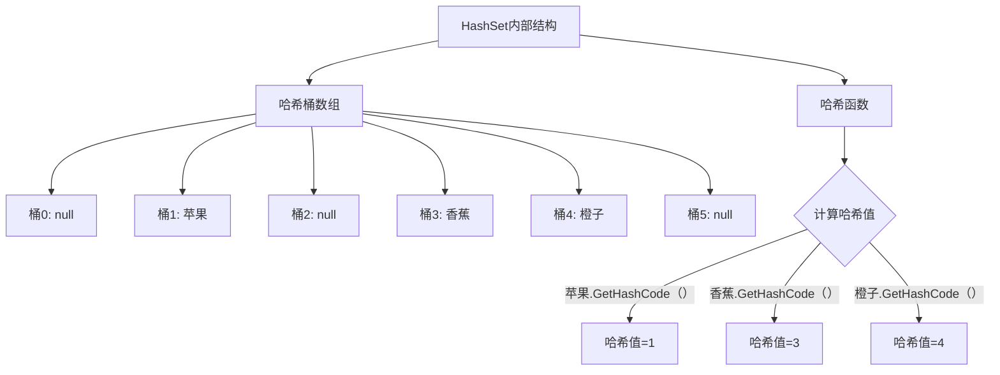
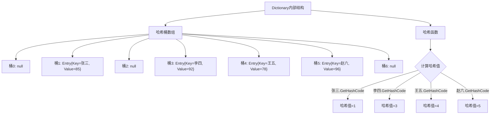
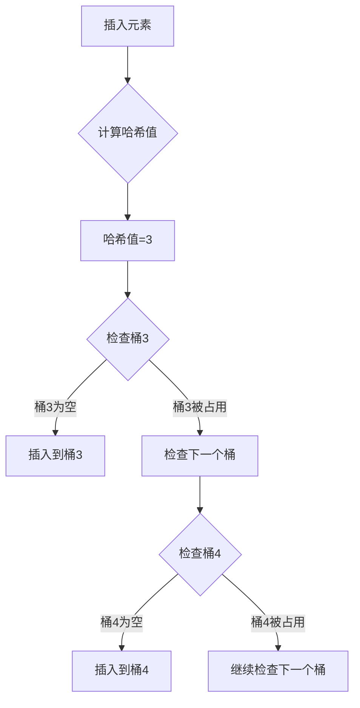
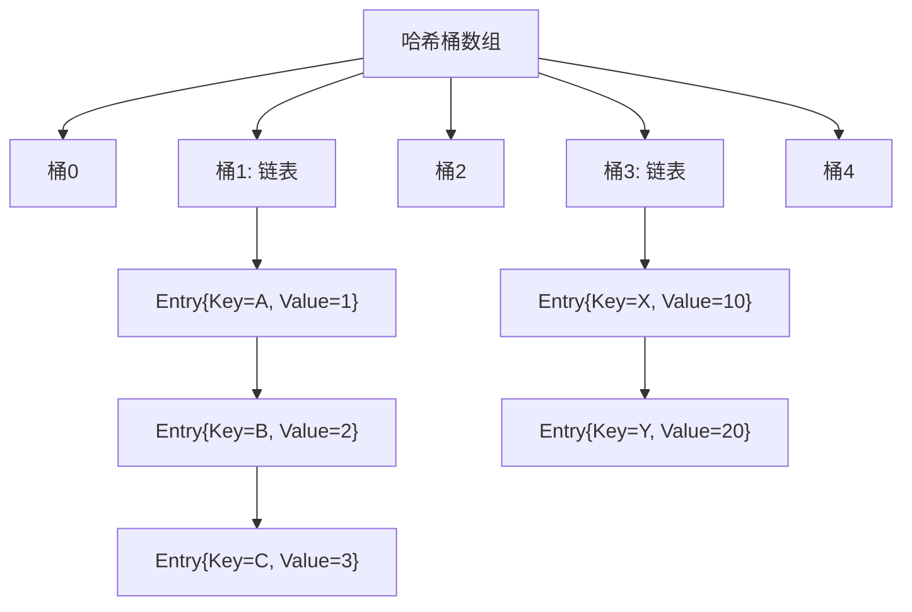

# C#集合全面解析


**本文收录于《控制工程自学指南》上位机篇，© 2025 SAJalon**

---

## 前言

在C#编程中，集合是存储和操作数据的重要工具。本文将详细介绍C#中最常用的**哈希集合和字典类型**，通过简单易懂的例子帮助理解它们的使用方法和底层原理。

## 基础概念说明

### 什么是哈希（Hash）

哈希是一种将任意长度的数据转换为固定长度数值的算法。在集合中，哈希用于快速定位数据位置。

**通俗理解：哈希就像是给每个东西分配一个唯一的"房间号码"，把复杂的东西转换成简单的数字编号，方便快速找到它。**

想象一个图书管理员，图书馆里有100个房间（0-99号）。当有人给他一本书时，他需要决定把这本书放在哪个房间里。

哈希函数就像是他的"分配规则"：

*   书名是"西游记" → 用某种方法计算 → 房间号23
    
*   书名是"红楼梦" → 用同样方法计算 → 房间号67
    

这样，下次想找"西游记"时，直接去23号房间就能找到，不用在整个图书馆里找。

### 什么是字典（Dictionary）

字典是一种键值对（Key-Value Pair）集合，通过键可以快速查找对应的值。

**通俗理解：字典就像现实中的电话簿或字典，通过一个名字（键）快速找到对应的内容（值）。键不可重复存在。**

现实中的字典：

*   查"苹果" → 翻到拼音"píngguǒ" → 找到对应页码 → 看到解释
    
*   查"香蕉" → 翻到拼音"xiāngjiāo" → 找到对应页码 → 看到解释
    

编程中的字典：

*   Key（键）："苹果" → Value（值）："一种水果"
    
*   Key（键）："香蕉" → Value（值）："黄色的水果"
    

### 什么是哈希表（HashTable）

哈希表是实现字典的一种数据结构，通过哈希函数将键映射到数组索引上。**键不可重复存在。**

**通俗理解：哈希表就是用哈希技术实现的取餐柜**

1.  存东西时，输入物品名称（比如"猪脚饭"）
    
2.  系统自动计算出应该放在哪个格子（比如格子35）
    
3.  系统告诉你："请放在35号格子"
    
4.  下次要取时，输入"猪脚饭"，系统直接告诉你去35号格子拿
    

**整个过程：**

```plaintext
输入"猪脚饭" → 哈希函数计算 → 得到数字35 → 存到35号位置
输入"猪脚饭" → 哈希函数计算 → 得到数字35 → 直接去35号位置取
```

## HashSet 哈希集合

### 概念说明

HashSet是一个**不包含重复元素**的集合，内部使用哈希表实现，查找、添加、删除操作的时间复杂度都是O(1)。

**HashSet说是集合，但看起来使用方法更像List<T>数组。由于底层是通过哈希函数实现，所以便被称为集合。**

### 基本使用示例

```csharp
using System;
using System.Collections.Generic;

class Program
{
    static void Main()
    {
        // 创建一个HashSet
        HashSet<string> fruits = new HashSet<string>();
        
        // 添加元素
        fruits.Add("苹果");
        fruits.Add("香蕉");
        fruits.Add("橙子");
        fruits.Add("苹果"); // 重复元素不会被添加
        
        Console.WriteLine("水果集合中的元素数量：" + fruits.Count);
        // 输出：水果集合中的元素数量：3
        
        // 遍历集合并输出
        Console.WriteLine("集合中的水果：");
        foreach (string fruit in fruits)
        {
            Console.WriteLine(fruit);
        }
        // 输出：
        // 集合中的水果：
        // 苹果
        // 香蕉
        // 橙子
        
        // 检查元素是否存在
        bool hasApple = fruits.Contains("苹果");
        Console.WriteLine("是否包含苹果：" + hasApple);
        // 输出：是否包含苹果：True
        
        // 移除元素
        fruits.Remove("香蕉");
        Console.WriteLine("移除香蕉后的集合：");
        foreach (string fruit in fruits)
        {
            Console.WriteLine(fruit);
        }
        // 输出：
        // 移除香蕉后的集合：
        // 苹果
        // 橙子
    }
}

```

### HashSet底层原理图解



### HashSet常用方法

```csharp
using System;
using System.Collections.Generic;

class HashSetMethods
{
    static void Main()
    {
        HashSet<int> set1 = new HashSet<int> { 1, 2, 3, 4, 5 };
        HashSet<int> set2 = new HashSet<int> { 4, 5, 6, 7, 8 };
        
        Console.WriteLine("=== HashSet常用方法演示 ===");
        
        // UnionWith - 并集
        HashSet<int> union = new HashSet<int>(set1);
        union.UnionWith(set2);
        Console.WriteLine("并集：" + string.Join(", ", union));
        // 输出：并集：1, 2, 3, 4, 5, 6, 7, 8
        
        // IntersectWith - 交集
        HashSet<int> intersect = new HashSet<int>(set1);
        intersect.IntersectWith(set2);
        Console.WriteLine("交集：" + string.Join(", ", intersect));
        // 输出：交集：4, 5
        
        // ExceptWith - 差集
        HashSet<int> except = new HashSet<int>(set1);
        except.ExceptWith(set2);
        Console.WriteLine("差集：" + string.Join(", ", except));
        // 输出：差集：1, 2, 3
        
        // SymmetricExceptWith - 对称差集
        HashSet<int> symmetric = new HashSet<int>(set1);
        symmetric.SymmetricExceptWith(set2);
        Console.WriteLine("对称差集：" + string.Join(", ", symmetric));
        // 输出：对称差集：1, 2, 3, 6, 7, 8
    }
}

```

## Dictionary<TKey, TValue> 字典

### 概念说明

Dictionary<TKey, TValue>是C#中**最常用的键值对集合**，通过键可以快速获取对应的值。它**基于哈希表（HashTable）实现（但在数据存储类型方面有不同）**，提供了高效的查找性能。**不同的是**，Dictionary中的键值对是泛型类型，仅支持存储其在定义（创建）时就规定好的键值对类型。而HashTable中的键值对是Object类型，这意味着可以灵活、随意存储各种各样不同种类键值对。显而易见，使用Dictionary更安全一些。

### 基本使用示例

```csharp
using System;
using System.Collections.Generic;

class DictionaryBasics
{
    static void Main()
    {
        // 创建字典
        Dictionary<string, int> studentScores = new Dictionary<string, int>();
        
        // 添加键值对
        studentScores.Add("张三", 85);
        studentScores.Add("李四", 92);
        studentScores["王五"] = 78; // 另一种添加方式
        studentScores["赵六"] = 96;
        
        Console.WriteLine("学生人数：" + studentScores.Count);
        // 输出：学生人数：4
        
        // 通过键获取值
        int zhangsanScore = studentScores["张三"];
        Console.WriteLine("张三的成绩：" + zhangsanScore);
        // 输出：张三的成绩：85
        
        // 安全地获取值（避免KeyNotFoundException）
        if (studentScores.TryGetValue("李四", out int lisiScore))
        {
            Console.WriteLine("李四的成绩：" + lisiScore);
            // 输出：李四的成绩：92
        }
        
        // 遍历字典
        Console.WriteLine("\n所有学生成绩：");
        foreach (KeyValuePair<string, int> student in studentScores)
        {
            Console.WriteLine($"{student.Key}: {student.Value}分");
        }
        // 输出：
        // 所有学生成绩：
        // 张三: 85分
        // 李四: 92分
        // 王五: 78分
        // 赵六: 96分
        
        // 遍历键和值
        Console.WriteLine("\n所有学生姓名：");
        foreach (string name in studentScores.Keys)
        {
            Console.WriteLine(name);
        }
        
        Console.WriteLine("\n所有成绩：");
        foreach (int score in studentScores.Values)
        {
            Console.WriteLine(score);
        }
    }
}

```

### Dictionary底层原理图解



### Dictionary常用方法演示

```csharp
using System;
using System.Collections.Generic;

class DictionaryMethods
{
    static void Main()
    {
        Dictionary<string, string> capitals = new Dictionary<string, string>();
        
        // 添加元素
        capitals["中国"] = "北京";
        capitals["美国"] = "华盛顿";
        capitals["日本"] = "东京";
        capitals["法国"] = "巴黎";
        
        Console.WriteLine("=== Dictionary方法演示 ===\n");
        
        // ContainsKey - 检查是否包含指定键
        bool hasChina = capitals.ContainsKey("中国");
        Console.WriteLine("是否包含'中国'键：" + hasChina);
        // 输出：是否包含'中国'键：True
        
        // ContainsValue - 检查是否包含指定值
        bool hasTokyo = capitals.ContainsValue("东京");
        Console.WriteLine("是否包含'东京'值：" + hasTokyo);
        // 输出：是否包含'东京'值：True
        
        // Remove - 移除指定键的元素
        bool removed = capitals.Remove("日本");
        Console.WriteLine("移除日本：" + (removed ? "成功" : "失败"));
        // 输出：移除日本：成功
        
        // Clear - 清空所有元素
        Console.WriteLine("清空前元素数量：" + capitals.Count);
        // 输出：清空前元素数量：4
        capitals.Clear();
        Console.WriteLine("清空后元素数量：" + capitals.Count);
        // 输出：清空后元素数量：0
    }
}

```

## HashTable 哈希表

### 概念说明

HashTable是.NET Framework早期版本中的“哈希表直接实现键值对方式”**（现在不常用，但老代码中会遇到，现在常用的是Dictionary）**，性能相对较低。HashTable存储的是object类型的键值对，这意味着需要进行装箱和拆箱（类型转换）操作。

### HashTable与Dictionary的区别

| 特性 | HashTable | Dictionary |
| --- | --- | --- |
| 泛型支持 | 不支持 | 支持 |
| 性能 | 较低（装箱/拆箱） | 较高 |
| 类型安全 | 运行时检查 | 编译时检查 |
| .NET版本 | 1.0+ | 2.0+ |

### HashTable基本使用示例

```csharp
using System;
using System.Collections;

class HashTableBasics
{
    static void Main()
    {
        // 创建HashTable
        Hashtable employeeInfo = new Hashtable();
        
        // 添加键值对（键和值都是object类型）
        employeeInfo["001"] = "张三";
        employeeInfo["002"] = "李四";
        employeeInfo[3] = "王五"; // 键可以是不同类型
        employeeInfo["004"] = 25; // 值也可以是不同类型
        
        Console.WriteLine("员工数量：" + employeeInfo.Count);
        // 输出：员工数量：4
        
        // 通过键获取值
        string name = (string)employeeInfo["001"]; // 需要类型转换
        Console.WriteLine("员工001的姓名：" + name);
        // 输出：员工001的姓名：张三
        
        // 安全地获取值
        if (employeeInfo.ContainsKey("002"))
        {
            string empName = (string)employeeInfo["002"];
            Console.WriteLine("员工002的姓名：" + empName);
            // 输出：员工002的姓名：李四
        }
        
        // 遍历HashTable
        Console.WriteLine("\n所有员工信息：");
        foreach (DictionaryEntry entry in employeeInfo)
        {
            Console.WriteLine($"键：{entry.Key}, 值：{entry.Value}");
        }
        // 输出：
        // 所有员工信息：
        // 键：001, 值：张三
        // 键：002, 值：李四
        // 键：3, 值：王五
        // 键：004, 值：25
        
        // 移除元素
        employeeInfo.Remove("001");
        Console.WriteLine("\n移除员工001后的信息：");
        foreach (DictionaryEntry entry in employeeInfo)
        {
            Console.WriteLine($"键：{entry.Key}, 值：{entry.Value}");
        }
    }
}
```

## 集合实现的底层原理：哈希冲突处理机制

什么是哈希冲突？——当不同的键值产生相同的哈希码时，就发生了哈希冲突。

为什么会发生哈希冲突？——由于哈希算法计算出的结果是有限度的，而键的取值范畴可能是无限的，所以哈希冲突是不可避免的。

为什么需要哈希冲突解决机制？——如果没有冲突解决方法，当发生哈希冲突时，新的元素会覆盖已存在的元素，导致数据丢失。因此需要有效的机制来处理这种情况。

**继续图书馆的例子：**

*   "西游记"按照规则应该放在23号房间
    
*   假设"三国演义"按照同样的规则也算出来是23号房间
    

这就尴尬了！两个不同的书要放在同一个房间，这就是哈希冲突。

**解决办法：**

1.  **链式处理**：23号房间变成一个"小书架"，可以放多本书
    
2.  **重新找房间**：如果23号满了，就找24号、25号...直到找到空房间
    

### 开放寻址法示意图

开放寻址法是一种解决哈希冲突的方法，当发生冲突时，它会在哈希表中寻找下一个可用的位置来存储元素。所有的元素都存储在哈希表的数组中，没有使用额外的数据结构。



### 链式哈希法示意图

链式哈希法的基本思想是：为哈希表的每个位置维护一个链表（或其他数据结构），当发生冲突时，将冲突的元素存储在对应位置的链表中。



## 性能对比分析

### 时间复杂度对比表

| 操作 | List | HashSet | Dictionary<K,V> | HashTable |
| --- | --- | --- | --- | --- |
| 查找 | O(n) | O(1) | O(1) | O(1) |
| 插入 | O(1) | O(1) | O(1) | O(1) |
| 删除 | O(n) | O(1) | O(1) | O(1) |

## 最佳实践建议

### 1. 选择合适的集合类型

```csharp
// 场景1：只需要存储唯一值，且对性能有要求，还不需要键值对
HashSet<string> uniqueNames = new HashSet<string>();

// 场景2：需要通过键快速查找值
Dictionary<string, int> nameToAge = new Dictionary<string, int>();
```

### 2. 避免KeyNotFoundException

```csharp
Dictionary<string, int> scores = new Dictionary<string, int>();
scores["张三"] = 85;

// 推荐方式：使用TryGetValue
if (scores.TryGetValue("李四", out int score))
{
    Console.WriteLine($"李四的成绩：{score}");
}
else
{
    Console.WriteLine("未找到李四的成绩");
}

// 不推荐方式：直接访问可能不存在的键
// int score = scores["李四"]; // 会抛出异常

```

### 3. 合理预估容量

```csharp
// 如果知道大概需要存储的元素数量，可以预先指定容量
// 避免频繁扩容带来的性能开销
HashSet<int> numbers = new HashSet<int>(1000); // 预分配1000个元素的空间
Dictionary<string, int> mapping = new Dictionary<string, int>(500); // 预分配空间

```

## 总结

1.  **HashSet**用于存储唯一元素，基于哈希表实现，查找效率高
    
2.  **Dictionary<TKey, TValue>**键值对集合（基于哈希表但有不同），通过键快速查找值
    
3.  **HashTable****：**早期的键值对（哈希表直接实现），性能较低
    
4.  **底层原理**：哈希函数、哈希冲突处理机制
    
5.  **实际应用**：如何在项目中合理使用这些集合类型
    
    1.  现代开发：优先使用`Dictionary<TKey, TValue>`和`HashSet<T>`
        
    2.  多线程环境：考虑使用`ConcurrentDictionary<TKey, TValue>`（后面会讲到）
        
    3.  上古代码：可能会遇到`HashTable`，需要了解其特性和限制
        
    4.  性能要求高：`Dictionary` > `HashTable`
        

选择合适的集合类型对程序性能至关重要。在需要快速查找、插入、删除操作时，优先考虑HashSet和Dictionary。
