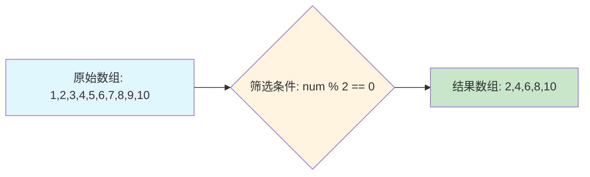
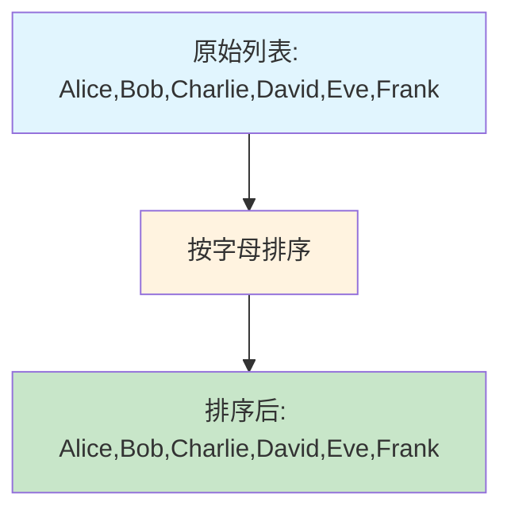
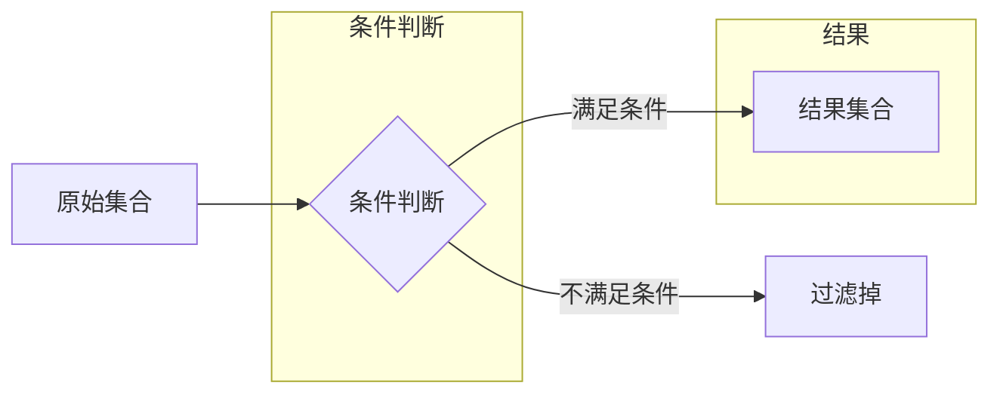
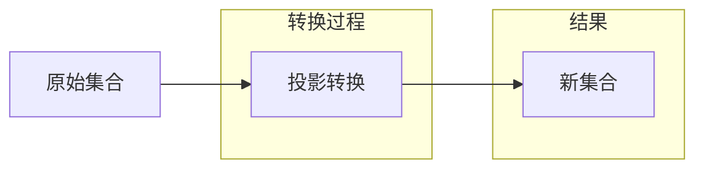
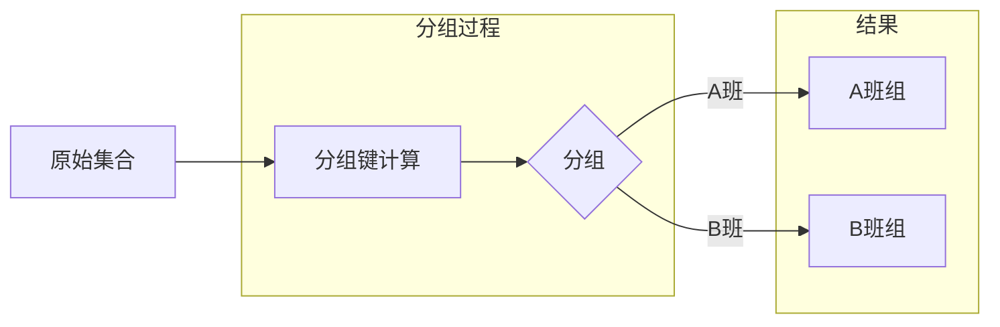
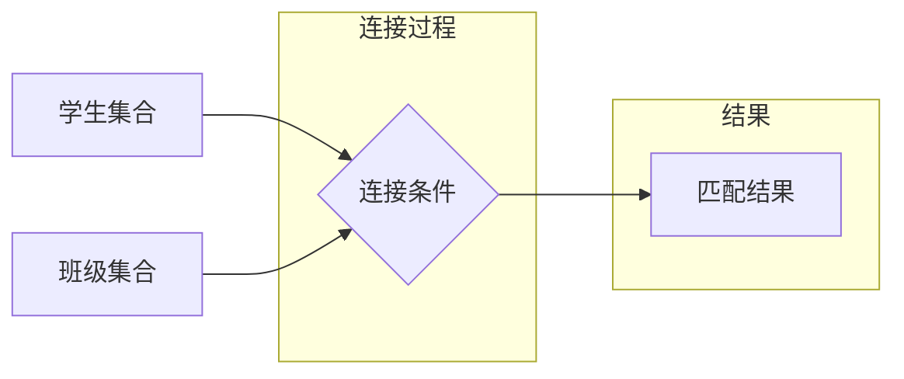
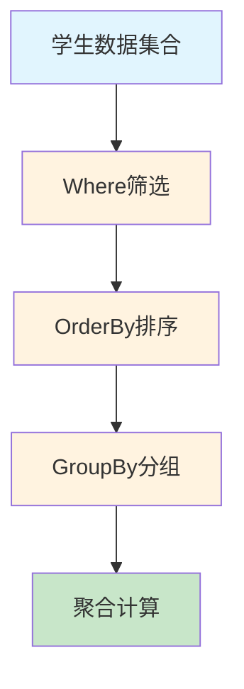
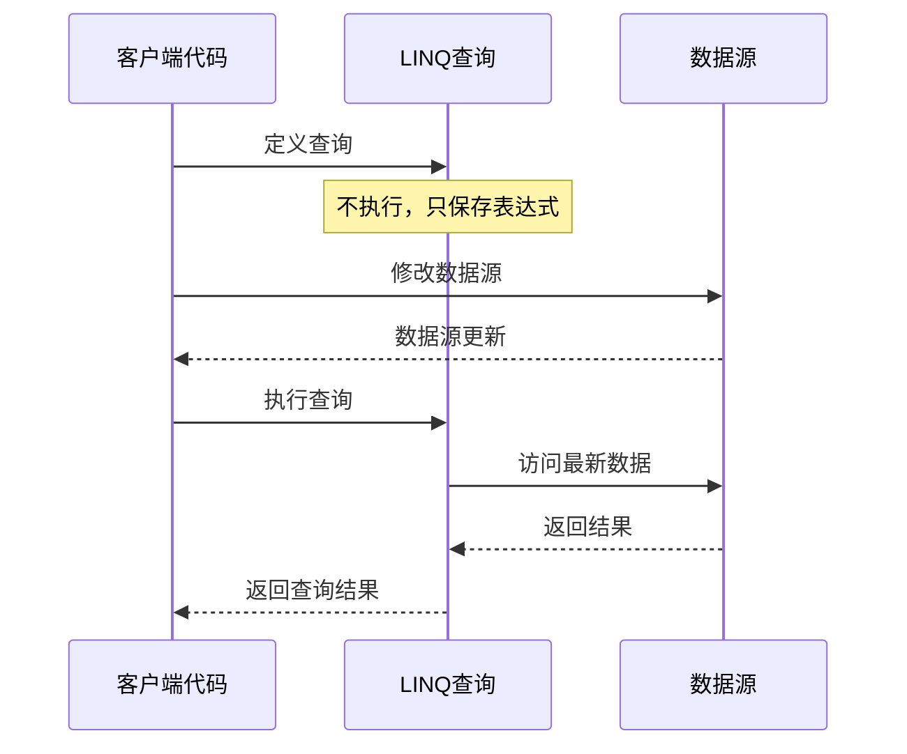
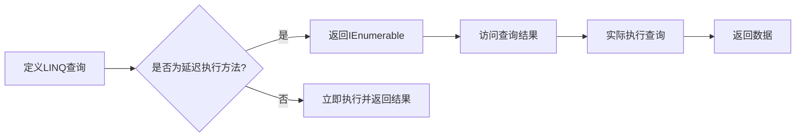

# C# LINQ全面解析


**本文收录于《控制工程自学指南》上位机篇，© 2025 SAJalon**

---

## 前言

LINQ（Language Integrated Query，语言集成查询）是 C# 中一个强大的特性，它允许开发者使用类似 SQL 的语法来查询各种数据源。本文将通过简单易懂的案例，全面梳理 LINQ 的使用方法和底层原理。

## 什么是 LINQ？

**LINQ（Language Integrated Query）** 是 .NET Framework 3.5 引入的一个特性，它将查询功能直接集成到 C# 语言中。通过 LINQ，我们可以用统一的语法查询内存中的**数组、集合、数据库、XML 等其中各种数据源，凡是可枚举的对象皆可使用LINQ**。

### LINQ 的核心概念

*   **查询表达式**：使用类似 SQL 的语法编写的查询语句
    
*   **方法语法**：使用扩展方法链式调用的方式
    
*   **延迟执行**：大多数 LINQ 操作不会立即执行，而是在枚举时才执行
    
*   **立即执行**：某些操作会立即执行并返回结果
    

### LINQ 的优势

*   **统一语法：**无论查询什么类型的数据，都使用相同的语法
    
*   **类型安全：**编译时检查，减少运行时错误
    
*   **延迟执行：**提高查询性能
    

### 效果比较

**非LINQ方式** 输出数组中 大于等于2 的元素：

```csharp
using System;

class Program
{
    static void Main()
    {
        var collection = new int[] { 1, 2, 2, 3, 4, 6 };
        for (int i = 0; i < collection.Length; i++)
        {
            if (collection[i] >= 2)
            {
                 Console.WriteLine(collection[i]);
            }
        }
    }
}
```

以 **LINQ方式** 输出数组中 大于等于2 的元素：

```csharp
using System;

class Program
{
    static void Main()
    {
        var collection = new int[] { 1, 2, 2, 3, 4, 6 };
        foreach (var item in collection.Where(item => item >= 2))
            Console.WriteLine(item);
    }
}
```

## LINQ 的基本语法

LINQ 提供了三种语法形式

### 1. 查询表达式语法（Query Syntax）

```csharp
var result = from item in collection
             where item.Condition
             select item;

var result = from student in students
             where student.Age > 18
             select student.Name;
```

### 2. 方法语法（Method Syntax）

```csharp
var result = collection.Where(item => item.Condition);

var result = students.Where(s => s.Age > 18)
                     .Select(s => s.Name);
```

### 3. 混合语法（Mixed Syntax）

```csharp
var result = (from student in students
              where student.Age > 18
              select student).ToList();
```

## 基础案例演示

让我们通过一些简单的例子来理解 LINQ 的使用。

### 案例1：基本的查询操作

```csharp
using System;
using System.Collections.Generic;
using System.Linq;

class Program
{
    static void Main()
    {
        // 创建一个整数数组

        int[ ] numbers = { 1, 2, 3, 4, 5, 6, 7, 8, 9, 10 };

        
        // 使用 LINQ 查询表达式找出所有偶数
        var evenNumbers = from num in numbers
                          where num % 2 == 0
                          select num;
        
        Console.WriteLine("偶数：");
        foreach (var num in evenNumbers)
        {
            Console.Write(num + " ");
        }
        // 输出结果：2 4 6 8 10
        
        Console.WriteLine("\n" + new string('-', 30));
        
        // 使用方法语法实现相同功能
        var evenNumbersMethod = numbers.Where(num => num % 2 == 0);
        
        Console.WriteLine("使用方法语法的偶数：");
        foreach (var num in evenNumbersMethod)
        {
            Console.Write(num + " ");
        }
        // 输出结果：2 4 6 8 10
    }
}

```

### 数据流向图解



### 案例2：字符串集合操作

```csharp
using System;
using System.Collections.Generic;
using System.Linq;

class Program
{
    static void Main()
    {
        // 创建一个字符串列表
        List<string> names = new List<string> 
        { 
            "Alice", "Bob", "Charlie", "David", "Eve", "Frank" 
        };
        
        // 找出名字长度大于4的人员
        var longNames = from name in names
                        where name.Length > 4
                        select name;
        
        Console.WriteLine("名字长度大于4的人员：");
        foreach (var name in longNames)
        {
            Console.WriteLine(name);
        }
        // 输出结果：
        // Charlie
        // David
        // Frank
        
        Console.WriteLine(new string('-', 30));
        
        // 按字母顺序排序
        var sortedNames = names.OrderBy(name => name);
        
        Console.WriteLine("按字母顺序排序：");
        foreach (var name in sortedNames)
        {
            Console.WriteLine(name);
        }
        // 输出结果：
        // Alice
        // Bob
        // Charlie
        // David
        // Eve
        // Frank
    }
}

```

### 排序流程图解



## LINQ 常用操作符详解

### 1. 筛选操作符

#### Where - 条件筛选

Where 操作符用于根据指定条件筛选集合中的元素。

```csharp
using System;
using System.Collections.Generic;
using System.Linq;

class Program
{
    static void Main()
    {
        // 创建学生集合
        var students = new List<Student>
        {
            new Student { Id = 1, Name = "张三", Age = 20, Score = 85 },
            new Student { Id = 2, Name = "李四", Age = 17, Score = 92 },
            new Student { Id = 3, Name = "王五", Age = 22, Score = 78 },
            new Student { Id = 4, Name = "赵六", Age = 19, Score = 88 }
        };

        // 筛选年龄大于18岁的学生
        var adultStudents = students.Where(s => s.Age > 18);

        Console.WriteLine("年龄大于18岁的学生：");
        foreach (var student in adultStudents)
        {
            Console.WriteLine($"姓名：{student.Name}，年龄：{student.Age}");
        }
        // 输出结果：
        // 姓名：张三，年龄：20
        // 姓名：王五，年龄：22
        // 姓名：赵六，年龄：19
    }
}

class Student
{
    public int Id { get; set; }
    public string Name { get; set; }
    public int Age { get; set; }
    public int Score { get; set; }
}
```


### 2. 排序操作符

#### OrderBy - 升序排序

```csharp
using System;
using System.Linq;

class Program
{
    static void Main()
    {

        int[ ] numbers = { 5, 2, 8, 1, 9, 3 };

        
        // 升序排序
        var ascending = numbers.OrderBy(x => x);
        
        Console.WriteLine("升序排序：");
        foreach (var num in ascending)
        {
            Console.Write(num + " ");
        }
        // 输出结果：1 2 3 5 8 9
    }
}

```

#### OrderByDescending - 降序排序

```csharp
using System;
using System.Linq;

class Program
{
    static void Main()
    {

        int[ ] numbers = { 5, 2, 8, 1, 9, 3 };

        
        // 降序排序
        var descending = numbers.OrderByDescending(x => x);
        
        Console.WriteLine("降序排序：");
        foreach (var num in descending)
        {
            Console.Write(num + " ");
        }
        // 输出结果：9 8 5 3 2 1
    }
}

```

### 3. 投影操作符

#### Select - 数据转换（投影转换）

Select 操作符用于从每个元素中选择特定的属性或创建新的对象。

```csharp
using System;
using System.Collections.Generic;
using System.Linq;

class Program
{
    static void Main()
    {
        var students = new List<Student>
        {
            new Student { Id = 1, Name = "张三", Age = 20, Score = 85 },
            new Student { Id = 2, Name = "李四", Age = 17, Score = 92 },
            new Student { Id = 3, Name = "王五", Age = 22, Score = 78 }
        };

        // 只选择学生的姓名
        var names = students.Select(s => s.Name);
        Console.WriteLine("学生姓名列表：");
        foreach (var name in names)
        {
            Console.WriteLine(name);
        }
        // 输出结果：
        // 张三
        // 李四
        // 王五

        Console.WriteLine();

        // 创建新的匿名对象
        var studentInfo = students.Select(s => new { 
            姓名 = s.Name, 
            成绩等级 = s.Score >= 90 ? "优秀" : "良好" 
        });
        
        Console.WriteLine("学生成绩信息：");
        foreach (var info in studentInfo)
        {
            Console.WriteLine($"姓名：{info.姓名}，成绩等级：{info.成绩等级}");
        }
        // 输出结果：
        // 姓名：张三，成绩等级：良好
        // 姓名：李四，成绩等级：优秀
        // 姓名：王五，成绩等级：良好
    }
}

class Student
{
    public int Id { get; set; }
    public string Name { get; set; }
    public int Age { get; set; }
    public int Score { get; set; }
}
```


### 4. GroupBy - 分组操作

GroupBy 操作符用于将集合中的元素按照指定的键进行分组。

```csharp
using System;
using System.Collections.Generic;
using System.Linq;

class Program
{
    static void Main()
    {
        var students = new List<Student>
        {
            new Student { Id = 1, Name = "张三", Age = 20, Score = 85, Class = "A班" },
            new Student { Id = 2, Name = "李四", Age = 17, Score = 92, Class = "A班" },
            new Student { Id = 3, Name = "王五", Age = 22, Score = 78, Class = "B班" },
            new Student { Id = 4, Name = "赵六", Age = 19, Score = 88, Class = "B班" },
            new Student { Id = 5, Name = "钱七", Age = 21, Score = 95, Class = "A班" }
        };

        // 按班级分组
        var groupedByClass = students.GroupBy(s => s.Class);
        
        Console.WriteLine("按班级分组：");
        foreach (var group in groupedByClass)
        {
            Console.WriteLine($"班级：{group.Key}");
            foreach (var student in group)
            {
                Console.WriteLine($"  - {student.Name}（成绩：{student.Score}）");
            }
        }
        // 输出结果：
        // 班级：A班
        //   - 张三（成绩：85）
        //   - 李四（成绩：92）
        //   - 钱七（成绩：95）
        // 班级：B班
        //   - 王五（成绩：78）
        //   - 赵六（成绩：88）
    }
}

class Student
{
    public int Id { get; set; }
    public string Name { get; set; }
    public int Age { get; set; }
    public int Score { get; set; }
    public string Class { get; set; }
}
```


### 5. Join - 连接操作

Join 操作符用于将两个集合基于共同的键进行连接。

```csharp
using System;
using System.Collections.Generic;
using System.Linq;

class Program
{
    static void Main()
    {
        // 学生信息
        var students = new List<Student>
        {
            new Student { Id = 1, Name = "张三", ClassId = 1 },
            new Student { Id = 2, Name = "李四", ClassId = 2 },
            new Student { Id = 3, Name = "王五", ClassId = 1 }
        };

        // 班级信息
        var classes = new List<Class>
        {
            new Class { Id = 1, ClassName = "计算机科学与技术" },
            new Class { Id = 2, ClassName = "软件工程" }
        };

        // 内连接：获取学生及其班级信息
        var studentWithClass = from student in students
                              join cls in classes on student.ClassId equals cls.Id
                              select new
                              {
                                  StudentName = student.Name,
                                  ClassName = cls.ClassName
                              };

        Console.WriteLine("学生班级信息：");
        foreach (var item in studentWithClass)
        {
            Console.WriteLine($"{item.StudentName} - {item.ClassName}");
        }
        // 输出结果：
        // 张三 - 计算机科学与技术
        // 李四 - 软件工程
        // 王五 - 计算机科学与技术
    }
}

class Student
{
    public int Id { get; set; }
    public string Name { get; set; }
    public int ClassId { get; set; }
}

class Class
{
    public int Id { get; set; }
    public string ClassName { get; set; }
}
```


### 6. 聚合操作符

#### Count - 计数

```csharp
using System;
using System.Linq;

class Program
{
    static void Main()
    {

        int[ ] numbers = { 1, 2, 3, 4, 5, 6, 7, 8, 9, 10 };

        
        // 统计偶数的个数
        var evenCount = numbers.Count(x => x % 2 == 0);
        
        Console.WriteLine($"偶数个数：{evenCount}");
        // 输出结果：偶数个数：5
    }
}

```

#### Sum - 求和

```csharp
using System;
using System.Linq;

class Program
{
    static void Main()
    {

        int[ ] numbers = { 1, 2, 3, 4, 5 };

        
        // 计算总和
        var sum = numbers.Sum();
        
        Console.WriteLine($"总和：{sum}");
        // 输出结果：总和：15
    }
}

```

#### Max/Min - 最大值/最小值

```csharp
using System;
using System.Linq;

class Program
{
    static void Main()
    {

        int[ ] numbers = { 3, 1, 4, 1, 5, 9, 2, 6 };

        
        // 找出最大值和最小值
        var max = numbers.Max();
        var min = numbers.Min();
        
        Console.WriteLine($"最大值：{max}");  // 输出：最大值：9
        Console.WriteLine($"最小值：{min}");  // 输出：最小值：1
    }
}

```

## 复杂案例：学生管理系统

让我们通过一个更复杂的例子来展示 LINQ 的强大功能。

```csharp
using System;
using System.Collections.Generic;
using System.Linq;

// 学生类
public class Student
{
    public int Id { get; set; }
    public string Name { get; set; }
    public int Age { get; set; }
    public double Score { get; set; }
    public string Major { get; set; }
}

class Program
{
    static void Main()
    {
        // 创建学生列表
        List<Student> students = new List<Student>
        {
            new Student { Id = 1, Name = "张三", Age = 20, Score = 85.5, Major = "计算机" },
            new Student { Id = 2, Name = "李四", Age = 21, Score = 92.0, Major = "数学" },
            new Student { Id = 3, Name = "王五", Age = 19, Score = 78.5, Major = "计算机" },
            new Student { Id = 4, Name = "赵六", Age = 22, Score = 88.0, Major = "物理" },
            new Student { Id = 5, Name = "钱七", Age = 20, Score = 95.5, Major = "计算机" }
        };
        
        Console.WriteLine("=== 所有学生信息 ===");
        foreach (var student in students)
        {
            Console.WriteLine($"ID:{student.Id}, 姓名:{student.Name}, 年龄:{student.Age}, 成绩:{student.Score}, 专业:{student.Major}");
        }
        
        Console.WriteLine("\n=== LINQ 查询演示 ===");
        
        // 1. 找出成绩大于85分的学生
        var highScoreStudents = students.Where(s => s.Score > 85);
        Console.WriteLine("\n成绩大于85分的学生：");
        foreach (var student in highScoreStudents)
        {
            Console.WriteLine($"{student.Name}: {student.Score}");
        }
        // 输出结果：
        // 李四: 92
        // 赵六: 88
        // 钱七: 95.5
        
        // 2. 按成绩降序排列
        var sortedByScore = students.OrderByDescending(s => s.Score);
        Console.WriteLine("\n按成绩降序排列：");
        foreach (var student in sortedByScore)
        {
            Console.WriteLine($"{student.Name}: {student.Score}");
        }
        // 输出结果：
        // 钱七: 95.5
        // 李四: 92
        // 赵六: 88
        // 张三: 85.5
        // 王五: 78.5
        
        // 3. 统计计算机专业的学生
        var csStudents = students.Where(s => s.Major == "计算机");
        Console.WriteLine("\n计算机专业的学生：");
        foreach (var student in csStudents)
        {
            Console.WriteLine($"{student.Name}");
        }
        // 输出结果：
        // 张三
        // 王五
        // 钱七
        
        // 4. 计算平均成绩
        var averageScore = students.Average(s => s.Score);
        Console.WriteLine($"\n平均成绩：{averageScore:F2}");
        // 输出结果：平均成绩：87.90
        
        // 5. 分组查询：按专业分组
        var groupedByMajor = students.GroupBy(s => s.Major);
        Console.WriteLine("\n按专业分组：");
        foreach (var group in groupedByMajor)
        {
            Console.WriteLine($"{group.Key}专业：");
            foreach (var student in group)
            {
                Console.WriteLine($"  {student.Name}");
            }
        }
        // 输出结果：
        // 计算机专业：
        //   张三
        //   王五
        //   钱七
        // 数学专业：
        //   李四
        // 物理专业：
        //   赵六
    }
}

```

### 数据处理流程图



### 高级查询示例

```csharp
static void AdvancedQueryExamples(List<Student> students)
{
    Console.WriteLine("=== 高级查询示例 ===\n");

    // 1. 复合筛选条件
    Console.WriteLine("1. 筛选计算机科学专业且成绩大于80分的学生：");
    var csTopStudents = students.Where(s => s.Major == "计算机科学" && s.Score > 80);
    foreach (var student in csTopStudents)
    {
        Console.WriteLine($"   {student.Name} - {student.Major} - {student.Score}分");
    }
    // 输出结果：
    // 张三 - 计算机科学 - 85.5分

    Console.WriteLine();

    // 2. 分组查询 - 按专业分组统计学生数量
    Console.WriteLine("2. 按专业分组统计学生数量：");
    var groupByMajor = students.GroupBy(s => s.Major);
    foreach (var group in groupByMajor)
    {
        Console.WriteLine($"   {group.Key}专业：{group.Count()}人");
        foreach (var student in group)
        {
            Console.WriteLine($"     - {student.Name}");
        }
    }
    // 输出结果：
    // 计算机科学专业：2人
    //   - 张三
    //   - 王五
    // 数学专业：2人
    //   - 李四
    //   - 钱七
    // 物理专业：1人
    //   - 赵六

    Console.WriteLine();

    // 3. 聚合函数 - 计算平均分
    Console.WriteLine("3. 各专业平均分：");
    var avgScoreByMajor = students.GroupBy(s => s.Major)
                                  .Select(g => new 
                                  { 
                                      Major = g.Key, 
                                      AverageScore = g.Average(s => s.Score) 
                                  });
    foreach (var item in avgScoreByMajor)
    {
        Console.WriteLine($"   {item.Major}专业平均分：{item.AverageScore:F1}分");
    }
    // 输出结果：
    // 计算机科学专业平均分：82.0分
    // 数学专业平均分：93.8分
    // 物理专业平均分：88.0分

    Console.WriteLine();

    // 4. 连接查询 - 模拟学生和课程的关系
    var courses = new List<Course>
    {
        new Course { Id = 1, Name = "C#编程", StudentId = 1 },
        new Course { Id = 2, Name = "高等数学", StudentId = 1 },
        new Course { Id = 3, Name = "线性代数", StudentId = 2 },
        new Course { Id = 4, Name = "数据结构", StudentId = 3 }
    };

    Console.WriteLine("4. 查询学生及其选修课程：");
    var studentCourses = from student in students
                         join course in courses on student.Id equals course.StudentId into courseGroup
                         select new 
                         { 
                             StudentName = student.Name, 
                             Courses = courseGroup.Select(c => c.Name) 
                         };

    foreach (var item in studentCourses)
    {
        Console.WriteLine($"   {item.StudentName}选修的课程：");
        if (item.Courses.Any())
        {
            foreach (var course in item.Courses)
            {
                Console.WriteLine($"     - {course}");
            }
        }
        else
        {
            Console.WriteLine("     - 无选修课程");
        }
    }
    // 输出结果：
    // 张三选修的课程：
    //   - C#编程
    //   - 高等数学
    // 李四选修的课程：
    //   - 线性代数
    // 王五选修的课程：
    //   - 数据结构
    // 赵六选修的课程：
    //   - 无选修课程
    // 钱七选修的课程：
    //   - 无选修课程
}

// 课程类定义
public class Course
{
    public int Id { get; set; }
    public string Name { get; set; }
    public int StudentId { get; set; }
}
```

## 常用 LINQ 方法汇总 [更多方法点击前往官网详细了解](https://learn.microsoft.com/zh-cn/dotnet/api/system.linq.enumerable?view=net-9.0)

### 筛选和投影方法

| 方法 | 说明 | 示例 |
| --- | --- | --- |
| Where | 筛选满足条件的元素 | `list.Where(x => x > 5)` |
| Select | 投影转换元素 | `list.Select(x => x * 2)` |
| SelectMany | 展平嵌套集合 | `list.SelectMany(x => x.Items)` |

### 排序方法

| 方法 | 说明 | 示例 |
| --- | --- | --- |
| OrderBy | 升序排序 | `list.OrderBy(x => x.Name)` |
| OrderByDescending | 降序排序 | `list.OrderByDescending(x => x.Age)` |
| ThenBy | 二级排序 | `list.OrderBy(x => x.Name).ThenBy(x => x.Age)` |

### 分组和聚合方法

| 方法 | 说明 | 示例 |
| --- | --- | --- |
| GroupBy | 按键分组 | `list.GroupBy(x => x.Category)` |
| Count | 计数 | `list.Count()` |
| Sum | 求和 | `list.Sum(x => x.Price)` |
| Average | 平均值 | `list.Average(x => x.Score)` |
| Max/Min | 最大/最小值 | `list.Max(x => x.Age)` |

### 元素操作方法

| 方法 | 说明 | 示例 |
| --- | --- | --- |
| First | 获取第一个元素 | `list.First()` |
| Last | 获取最后一个元素 | `list.Last()` |
| Single | 获取唯一元素 | `list.Single(x => x.Id == 1)` |
| ElementAt | 获取指定位置元素 | `list.ElementAt(2)` |

## LINQ 延迟执行特性

LINQ 的一个重要特性是延迟执行，这意味着查询的定义和实际执行是分离的。查询不会立即执行，而是在实际需要数据时才执行。

### 延迟执行示例

```csharp
Console.WriteLine("=== 延迟执行示例 ===");

List<int> numbers = new List<int> { 1, 2, 3, 4, 5 };
Console.WriteLine("1. 定义查询时：");
var query = numbers.Where(n => n > 2);  // 此时不会执行筛选
Console.WriteLine("   查询已定义，但未执行");

numbers.Add(6);  // 在查询执行前修改数据源
numbers.Add(7);

Console.WriteLine("2. 执行查询时：");
foreach (var item in query)  // 此时才真正执行筛选
{
    Console.WriteLine($"   {item}");
}
// 输出结果会包含6和7，因为它们在查询定义后被添加
// 输出：
// 3
// 4
// 5
// 6
// 7
```

### 延迟执行流程图



### 立即执行示例

```csharp
Console.WriteLine("\n=== 立即执行示例 ===");

List<int> numbers2 = new List<int> { 1, 2, 3, 4, 5 };
Console.WriteLine("1. 使用立即执行方法：");
var count = numbers2.Where(n => n > 2).Count();  // Count()是立即执行方法
Console.WriteLine($"   满足条件的元素数量：{count}");

numbers2.Add(6);
numbers2.Add(7);

Console.WriteLine("2. 再次计算数量：");
var count2 = numbers2.Where(n => n > 2).Count();
Console.WriteLine($"   修改后满足条件的元素数量：{count2}");
// 第一次输出：3（3,4,5）
// 第二次输出：5（3,4,5,6,7）
```

### LINQ执行流程图



## 性能考虑

### 1. 延迟执行 vs 立即执行

```csharp
// 延迟执行 - 返回 IEnumerable
var delayed = numbers.Where(x => x > 5);

// 立即执行 - 返回具体结果
var immediate = numbers.Where(x => x > 5).ToList();  // ToList() 立即执行

```

### 2. 避免重复查询

```csharp
// 不好的做法 - 每次都重新执行查询
var expensiveQuery = numbers.Where(x => SomeExpensiveOperation(x));
var count = expensiveQuery.Count();
var list = expensiveQuery.ToList();  // 重复执行了查询

// 好的做法 - 使用 ToList() 缓存结果
var cachedResult = numbers.Where(x => SomeExpensiveOperation(x)).ToList();
var count = cachedResult.Count;
var list = cachedResult;

```

### 3. 合理使用 ToList()

```csharp
// 当需要多次遍历时，使用 ToList() 避免重复查询
var query = students.Where(s => s.Age > 18);
var studentList = query.ToList(); // 执行一次查询

// 后续操作都基于内存中的列表
var count = studentList.Count();
var first = studentList.First();
```

## 常见错误和注意事项

### 1. Null 引用异常

```csharp
List<string> names = new List<string> { "Alice", null, "Bob" };

// 可能抛出 NullReferenceException
// var result = names.Where(name => name.Length > 3);

// 安全的做法
var result = names.Where(name => name != null && name.Length > 3);

```

### 2. 延迟执行的副作用

```csharp
List<int> numbers = new List<int> { 1, 2, 3 };
var query = numbers.Where(x => x > 1);

numbers.Clear();  // 修改了原始数据

// 此时查询结果为空，因为原始数据被清空了
foreach (var item in query)
{
    Console.WriteLine(item);  // 不会输出任何内容
}

```
