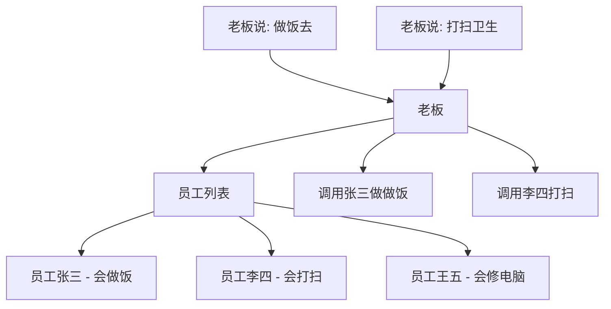
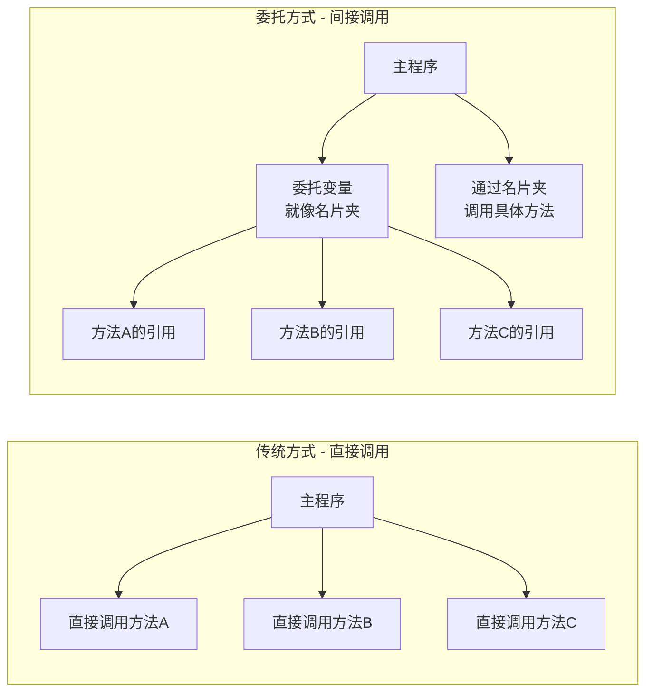
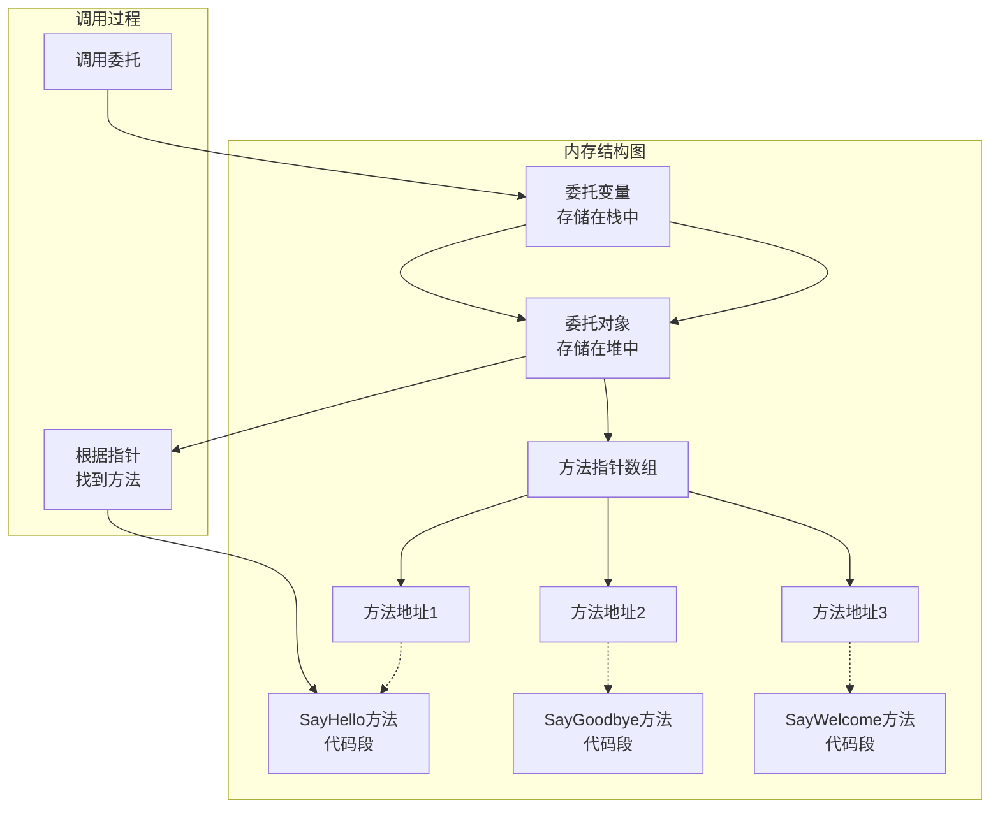
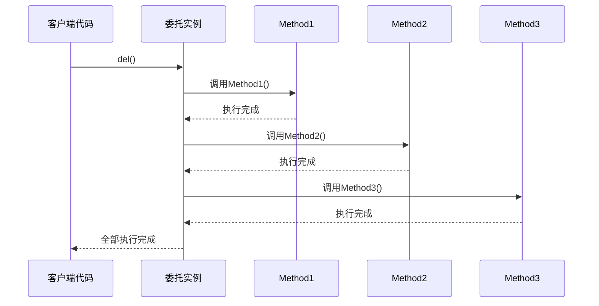

# C# 委托全面解析


**本文收录于《控制工程自学指南》上位机篇，© 2025 SAJalon**

---

## 什么是委托（Delegate）？

用现实生活中的例子来类比一下，想象一下你是公司老板，你需要让员工帮你完成一些工作：



在这个例子中：

*   委托 = 员工列表（存储了能做什么事情的员工）
    
*   方法 = 员工的具体技能（做饭、打扫、修电脑）
    
*   调用委托 = 老板分配任务
    

### 委托的本质是方法的"名片夹"

传统的方法调用方式是直接调用，而委托的方法调用方式是**“间接调用”**。



### 委托的核心概念

我们可以把委托理解为"方法的变量"（方法的名片夹），它可以存储方法的地址，并在需要时调用该方法。

*   **方法指针**：委托本质上是一个安全的方法指针
    
*   **类型安全**：委托只能指向签名匹配的方法
    
*   **多播特性**：一个委托可以同时指向多个方法
    
*   **面向对象**：委托是类，继承自System.Delegate
    

#### 便于理解

**委托就是方法的"变量"**：

*   可以把方法赋值给委托变量
    
*   可以通过委托变量来调用方法
    
*   一个委托可以指向多个方法（多播）
    
*   委托是类型安全的（签名必须匹配）
    

**核心概念**：

*   委托类型 = 方法的"名片模板"（定义了方法的签名）
    
*   委托实例 = 具体的"名片夹"（存储了方法的引用）
    
*   方法引用 = 选择名片并使用（指向具体的方法地址）
    

## 1. 委托的基本语法

### 1.1 声明委托

```csharp
// 声明一个委托类型 - 就像定义名片夹能装什么类型的名片
public delegate void MyDelegate(string message);

// 委托的签名必须与要指向的方法匹配
// 这里表示：返回值为void，接受一个string参数的方法
// 这个名片夹只能装：返回值为void，参数为string类型的方法名片
```

### 1.2 定义方法

```csharp
// 定义符合委托签名的方法1
public static void SayHello(string name)
{
    Console.WriteLine($"Hello, {name}!");
}

// 定义符合委托签名的方法2
public static void SayGoodbye(string name)
{
    Console.WriteLine($"Goodbye, {name}!");
}

```

### 1.3 使用委托

```csharp
class Program
{
    // 1.声明委托类型（名片夹模板）
    public delegate void MessageDelegate(string msg);
    

    static void Main(string[ ] args)

    {
        // 2.创建委托实例并指向方法（创建实际的名片夹，并放入方法名片）
        MessageDelegate del1 = new MessageDelegate(SayHello);
        MessageDelegate del2 = SayGoodbye; // 简化写法
        
        // 调用委托（通过名片夹找到方法并让他工作）
        del1("张三"); // 输出：Hello, 张三!
        del2("李四"); // 输出：Goodbye, 李四!
    }
    
    static void SayHello(string name)
    {
        Console.WriteLine($"Hello, {name}!");
    }
    
    static void SayGoodbye(string name)
    {
        Console.WriteLine($"Goodbye, {name}!");
    }
}

```

## 2. 委托的底层原理



## 3. 多播委托（Multicast Delegate）

多播委托是指一个委托可以同时指向多个方法（**一个“方法名片夹”放多张“方法名片”**），当调用委托时，会依次执行所有指向的方法。

```csharp
class Program
{
    public delegate void MultiDelegate();
    

    static void Main(string[ ] args)

    {
        // 创建委托实例
        MultiDelegate del = null;
        
        // 使用 += 操作符添加方法
        del += Method1;
        del += Method2;
        del += Method3;
        
        // 调用委托 - 会依次执行所有方法
        del(); 
        // 输出：
        // 执行方法1
        // 执行方法2
        // 执行方法3
        
        Console.WriteLine("-------------------");
        
        // 使用 -= 操作符移除方法
        del -= Method2;
        del();
        // 输出：
        // 执行方法1
        // 执行方法3
    }
    
    static void Method1()
    {
        Console.WriteLine("执行方法1");
    }
    
    static void Method2()
    {
        Console.WriteLine("执行方法2");
    }
    
    static void Method3()
    {
        Console.WriteLine("执行方法3");
    }
}

```

### 多播委托执行流程：



## 4. 带返回值的委托

当委托指向**多个有返回值的方法**时，只返回最后一个方法的执行结果。

```csharp
class Program
{
    public delegate int MathDelegate(int a, int b);
    

    static void Main(string[ ] args)

    {
        MathDelegate del = null;
        del += Add;
        del += Multiply;
        del += Subtract;
        
        // 只返回最后一个方法的结果
        int result = del(10, 5);
        Console.WriteLine($"结果: {result}"); // 输出：结果: 5
    }
    
    static int Add(int x, int y)
    {
        int result = x + y;
        Console.WriteLine($"Add: {x} + {y} = {result}");
        return result;
    }
    
    static int Multiply(int x, int y)
    {
        int result = x * y;
        Console.WriteLine($"Multiply: {x} * {y} = {result}");
        return result;
    }
    
    static int Subtract(int x, int y)
    {
        int result = x - y;
        Console.WriteLine($"Subtract: {x} - {y} = {result}");
        return result;
    }
}

```

## 5. 为什么需要委托

### 5.1 根据不同条件执行不同方法

```csharp
// 不使用委托的方式 - 代码冗余
static void ProcessByType(string type, string name)
{
    if (type == "hello")
        SayHello(name);
    else if (type == "goodbye")
        SayGoodbye(name);
    else if (type == "welcome")
        SayWelcome(name);
}

// 使用委托的方式 - 更加灵活
static void ProcessMessage(MessageDelegate processor, string name)
{
    // 我不需要知道具体是哪个方法，只需要调用就行
    processor(name);
}

static void Main(string[] args)
{
    // 可以动态决定使用哪个方法
    ProcessMessage(SayHello, "小明");    // 传递SayHello方法
    ProcessMessage(SayGoodbye, "小红");  // 传递SayGoodbye方法
}
```

### 5.2 事件处理

```csharp
// 按钮点击事件的简化示例
class Button
{
    // 声明一个委托类型的事件
    public delegate void ClickHandler();
    public event ClickHandler OnClick;
    
    // 模拟按钮被点击
    public void Click()
    {
        Console.WriteLine("按钮被点击了！");
        // 通知所有订阅者
        // ?指的是若OnClick不为空则执行Invoke()
        OnClick?.Invoke();  // 调用所有注册的方法
    }
}

class Program
{
    static void Main(string[] args)
    {
        Button btn = new Button();
        
        // 注册多个处理方法（就像多个部门关心按钮点击事件）
        btn.OnClick += ShowMessage;  // 当按钮点击时显示消息
        btn.OnClick += LogEvent;     // 当按钮点击时记录日志
        btn.OnClick += UpdateUI;     // 当按钮点击时更新界面
        
        // 触发事件
        btn.Click();
        // 所有注册的方法都会被执行
    }
    
    static void ShowMessage()
    {
        Console.WriteLine("显示提示消息");
    }
    
    static void LogEvent()
    {
        Console.WriteLine("记录日志");
    }
    
    static void UpdateUI()
    {
        Console.WriteLine("更新用户界面");
    }
}
```

## 6. 系统预定义委托

C# 提供了一些**常用的预定义委托类型**，避免我们每次都手动声明。

### 6.1 Action 委托（无返回值）

```csharp
class Program
{

    static void Main(string[ ] args)

    {
        // Action<T> - 无返回值，可带参数
        Action<string> printMessage = Console.WriteLine;
        Action<string, int> printInfo = (name, age) => 
            Console.WriteLine($"姓名: {name}, 年龄: {age}");
        
        printMessage("Hello World!"); // 输出：Hello World!
        printInfo("张三", 25); // 输出：姓名: 张三, 年龄: 25
    }
}

```

### 6.2 Func 委托（有返回值）

```csharp
class Program
{

    static void Main(string[ ] args)

    {
        // Func<T, TResult> - 有返回值，最后一个类型是返回值类型
        Func<int, int, int> add = (x, y) => x + y;
        Func<string, int> getLength = str => str.Length;
        Func<int> getRandom = () => new Random().Next(1, 100);
        
        int sum = add(10, 20); // 30
        int length = getLength("Hello"); // 5
        int randomNum = getRandom(); // 随机数
        
        Console.WriteLine($"Sum: {sum}, Length: {length}, Random: {randomNum}");
    }
}

```

### 6.3 Predicate 委托（布尔返回值）

```csharp
class Program
{

    static void Main(string[ ] args)

    {
        // Predicate<T> - 返回bool值的委托
        Predicate<int> isEven = x => x % 2 == 0;
        Predicate<string> isLongString = str => str.Length > 5;
        
        Console.WriteLine(isEven(4)); // True
        Console.WriteLine(isEven(3)); // False
        Console.WriteLine(isLongString("Hello World")); // True
        Console.WriteLine(isLongString("Hi")); // False
        
        // 在集合中使用
        List<int> numbers = new List<int> { 1, 2, 3, 4, 5, 6, 7, 8, 9, 10 };
        List<int> evenNumbers = numbers.FindAll(isEven);
        
        Console.WriteLine("偶数: " + string.Join(", ", evenNumbers));
        // 输出：偶数: 2, 4, 6, 8, 10
    }
}

```

## 7. 委托与Lambda表达式

Lambda表达式提供了一种更简洁的方式来创建委托。

```csharp
class Program
{
    public delegate bool FilterDelegate(int number);
    

    static void Main(string[ ] args)

    {
        // 传统方式
        FilterDelegate filter1 = IsPositive;
        
        // Lambda表达式方式
        FilterDelegate filter2 = (x) => x > 0;
        FilterDelegate filter3 = x => x > 0; // 参数类型可省略
        
        // 使用预定义委托
        Func<int, bool> filter4 = x => x > 0;
        Predicate<int> filter5 = x => x > 0;
        
        List<int> numbers = new List<int> { -2, -1, 0, 1, 2, 3, 4, 5 };
        
        // 使用不同方式的委托进行过滤
        var positive1 = numbers.FindAll(new Predicate<int>(IsPositive));
        var positive2 = numbers.FindAll(filter2);
        var positive3 = numbers.FindAll(x => x > 0);
        
        Console.WriteLine("正数: " + string.Join(", ", positive3));
        // 输出：正数: 1, 2, 3, 4, 5
    }
    
    static bool IsPositive(int number)
    {
        return number > 0;
    }
}

```

## 8. 委托的优势与使用场景

### 优势

1.  **解耦**：调用者和被调用者之间松耦合
    
2.  **灵活性**：运行时决定调用哪个方法
    
3.  **扩展性**：易于添加新的处理逻辑
    
4.  **复用性**：同一委托可以指向不同的方法
    

### 使用场景

1.  **事件处理**：Windows Forms、WPF等GUI编程
    
2.  **回调函数**：异步操作完成后的通知
    
3.  **策略模式**：运行时切换算法实现
    
4.  **LINQ查询**：Where、Select等扩展方法
    

## 9. 委托与接口的对比

```csharp
// 使用委托的方式
public delegate void ProcessDelegate(int value);

class DelegateExample
{

    static void ProcessData(int[ ] data, ProcessDelegate processor)

    {
        foreach (int item in data)
        {
            processor(item);
        }
    }
    
    static void PrintSquare(int x)
    {
        Console.WriteLine($"平方: {x * x}");
    }
}

// 使用接口的方式
interface IProcessor
{
    void Process(int value);
}

class InterfaceExample : IProcessor
{
    public void Process(int value)
    {
        Console.WriteLine($"处理: {value}");
    }
    

    static void ProcessData(int[ ] data, IProcessor processor)

    {
        foreach (int item in data)
        {
            processor.Process(item);
        }
    }
}

```

## 总结

委托是C#中一个非常重要的特性，它为程序提供了极大的灵活性。通过委托，我们可以：

1.  **将方法作为参数传递**
    
2.  **实现回调机制**
    
3.  **构建事件系统**
    
4.  **实现策略模式等设计模式**
