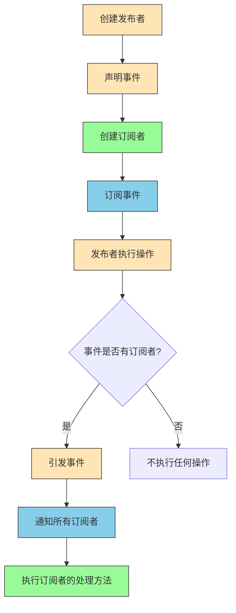
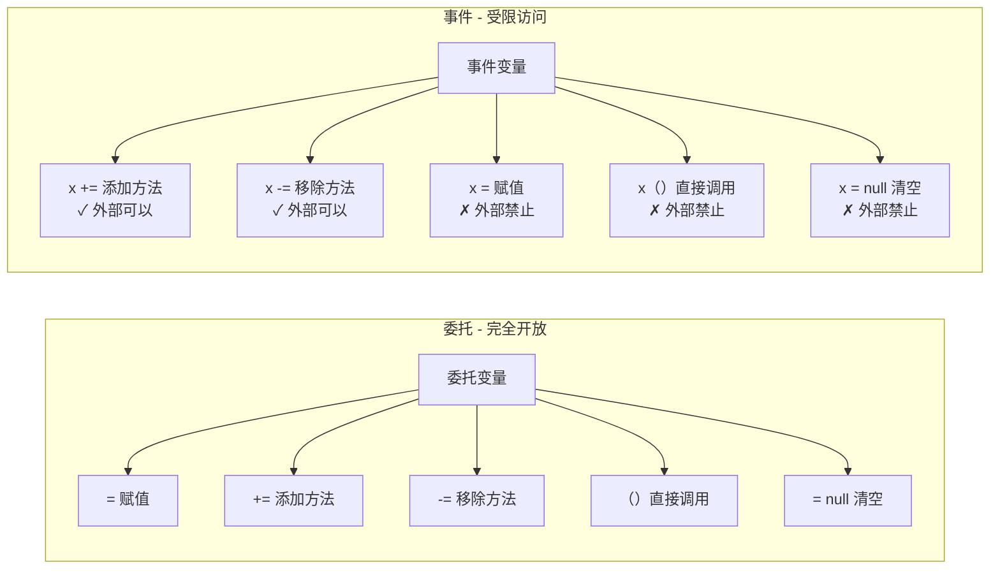
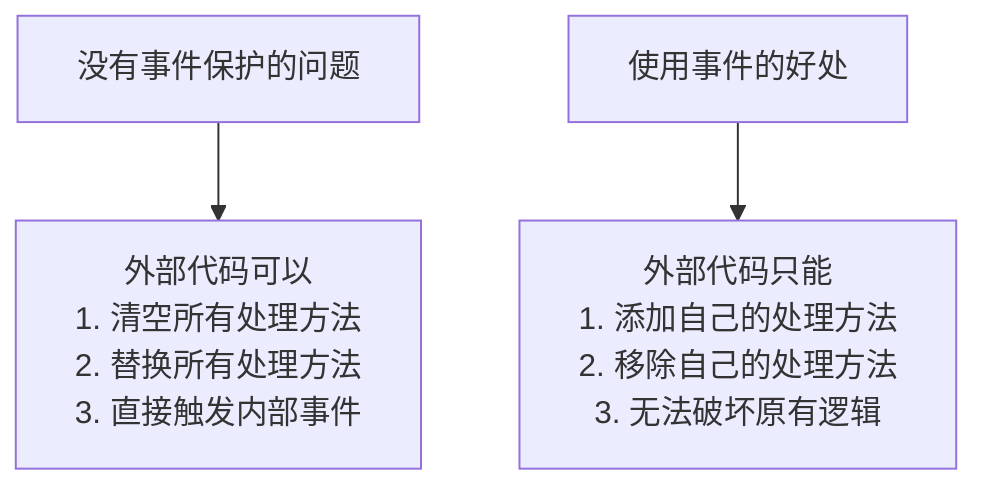
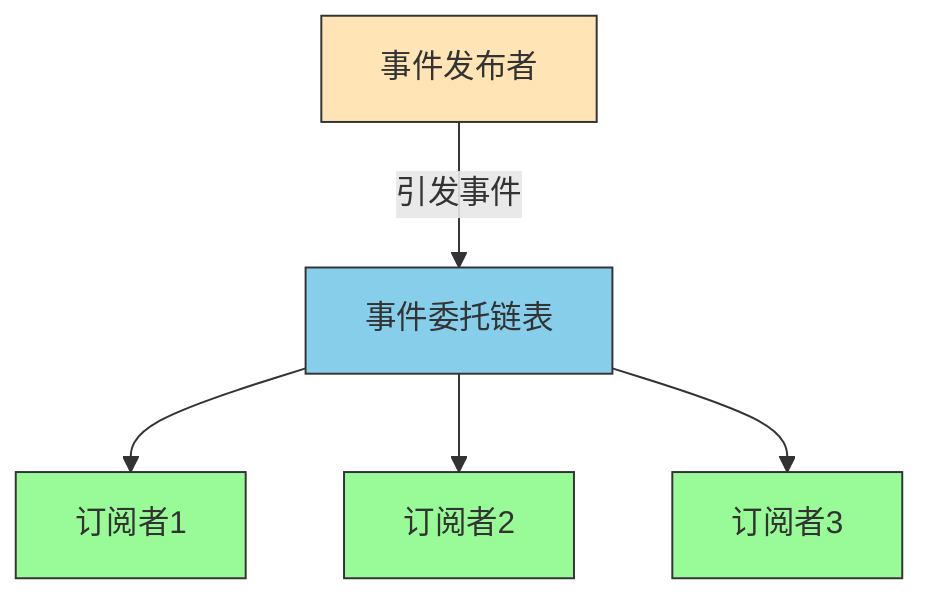
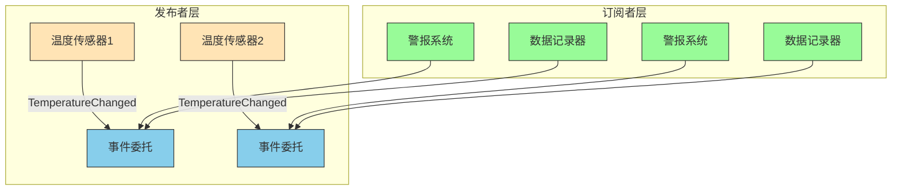

# C#事件全面解析


**本文收录于《控制工程自学指南》上位机篇，© 2025 SAJalon**

---

## 前言

事件是C#中非常重要的概念，它实现了观察者模式，让我们能够处理对象间的通知机制。

观察者模式是设计模式中的一种，定义了对象间的一对多依赖关系，当一个对象改变状态时，所有依赖它的对象都会收到通知并自动更新。

本文将全面解析C#中事件的使用方法。

## 什么是事件？

**委托（Delegate）**：方法的引用，可以像变量一样传递和调用方法。

**事件（Event）**：基于委托的封装，把“委托”包装了一下，在委托的基础上提供了更安全的方法调用机制。

**发布者（Publisher）**：是包含事件的类，负责在特定条件下引发（触发）事件。

**订阅者（Subscriber）**：是注册事件的类，当事件被引发时会收到通知并执行相应的处理逻辑。

## 事件的基本语法

```csharp
// 声明事件
public event EventHandler MyEvent;

// 引发事件
MyEvent?.Invoke(this, EventArgs.Empty);

```

*   **EventHandler**：.NET Framework 提供的标准事件处理程序委托类型，签名通常是：`void EventHandler(object sender, EventArgs e)`
    
*   **EventArgs**：事件参数的基类，用于传递事件相关的数据。
    
*   **Invoke**：用于安全地调用委托的方法，通常配合空条件运算符 `?.` 使用。
    
*   **+= 和 -= 运算符**：用于订阅和取消订阅事件的运算符。
    

### 事件声明的基本语法

```csharp
// 使用EventHandler<T>泛型委托
public event EventHandler<MyEventArgs> MyEvent;

// 使用自定义委托
public delegate void MyEventHandler(object sender, MyEventArgs e);
public event MyEventHandler MyEvent;

// 使用Action委托（简单事件）
public event Action<string> MessageEvent;
```

### 事件的基本操作

```csharp
// 订阅事件
publisher.MyEvent += EventHandlerMethod;

// 取消订阅事件
publisher.MyEvent -= EventHandlerMethod;

// 引发事件
MyEvent?.Invoke(this, new MyEventArgs());
```

### 事件语法使用示例

```csharp
using System;

// 1. 定义事件发布者类
public class SimplePublisher
{
    // 2. 声明事件 - 使用标准的EventHandler委托
    public event EventHandler SimpleEvent;
    
    // 3. 提供引发事件的方法
    public void DoSomething()
    {
        Console.WriteLine("发布者执行了某些操作");
        
        // 4. 引发事件（通知所有订阅者）
        SimpleEvent?.Invoke(this, EventArgs.Empty);
    }
}

// 5. 定义事件订阅者类
public class SimpleSubscriber
{
    private string name;
    
    public SimpleSubscriber(string subscriberName)
    {
        name = subscriberName;
    }
    
    // 6. 事件处理方法
    public void OnSimpleEvent(object sender, EventArgs e)
    {
        Console.WriteLine($"{name} 收到了事件通知！");
    }
}

class Program
{
    static void Main(string[] args)
    {
        // 7. 创建发布者和订阅者
        SimplePublisher publisher = new SimplePublisher();
        SimpleSubscriber subscriber1 = new SimpleSubscriber("订阅者1");
        SimpleSubscriber subscriber2 = new SimpleSubscriber("订阅者2");
        
        // 8. 订阅事件
        publisher.SimpleEvent += subscriber1.OnSimpleEvent;
        publisher.SimpleEvent += subscriber2.OnSimpleEvent;
        
        Console.WriteLine("第一次执行操作：");
        publisher.DoSomething();
        
        Console.WriteLine("\n取消订阅者1：");
        // 9. 取消订阅
        publisher.SimpleEvent -= subscriber1.OnSimpleEvent;
        
        Console.WriteLine("第二次执行操作：");
        publisher.DoSomething();
    }
}
```

**输出结果**：

```csharp
第一次执行操作：
发布者执行了某些操作
订阅者1 收到了事件通知！
订阅者2 收到了事件通知！

取消订阅者1：
第二次执行操作：
发布者执行了某些操作
订阅者2 收到了事件通知！
```

### 事件的工作流程图解



## 事件和委托的区别

> **事件是委托的特殊用法。**

> **事件是委托的"安全包装"。**

**委托就像是一个开放的通知公告栏。**

**任何人都可以查看通知单，任何人也都能张贴、修改、撕除通知单。**

**而事件就像是一个带锁的公告栏，虽然任何人都能查看通知单，但只有管理员才能张贴、修改、撕除通知单。**




**事件本质上就是带有访问限制的委托。**

### 代码示例对比

**委托的完全控制**

```c#
class Program
{
    // 1. 声明委托类型
    public delegate void MyDelegate(string message);
    
    static void Main(string[] args)
    {
        // 2. 创建委托实例
        MyDelegate myDelegate = null;
        
        // 3. 委托可以被完全控制（任何操作都可以）
        myDelegate = SayHello;           // ✓ 可以直接赋值
        myDelegate += SayGoodbye;        // ✓ 可以添加方法
        myDelegate();                    // ✓ 可以直接调用
        myDelegate = null;               // ✓ 可以清空
        myDelegate -= SayGoodbye;        // ✓ 可以移除方法
    }
    
    static void SayHello(string msg)
    {
        Console.WriteLine($"Hello: {msg}");
    }
    
    static void SayGoodbye(string msg)
    {
        Console.WriteLine($"Goodbye: {msg}");
    }
}
```

**事件的受限访问**

```c#
class Button
{
    // 1. 声明委托类型
    public delegate void ClickHandler(string buttonText);
    
    // 2. 声明事件（基于委托）
    public event ClickHandler OnClick;
    
    private string text;
    
    public Button(string buttonText)
    {
        text = buttonText;
    }
    
    // 3. 类内部可以完全控制事件
    public void SimulateClick()
    {
        // 类内部可以触发事件
        OnClick?.Invoke(text);  // ✓ 可以调用
    }
    
    public void TestEvent()
    {
        OnClick = null;         // ✓ 类内部可以赋值
        OnClick += SayHello;    // ✓ 类内部可以添加
        OnClick -= SayHello;    // ✓ 类内部可以移除
    }
}

class Program
{
    static void Main(string[] args)
    {
        Button button = new Button("提交按钮");
        
        // 4. 外部只能订阅和取消订阅
        button.OnClick += ShowMessage;    // ✓ 可以添加
        button.OnClick += LogClick;       // ✓ 可以添加
        button.OnClick -= ShowMessage;    // ✓ 可以移除
        
        // 5. 外部不能进行的危险操作
        // button.OnClick = null;         // ✗ 编译错误！
        // button.OnClick();              // ✗ 编译错误！
        // button.OnClick = SomeMethod;   // ✗ 编译错误！
        
        // 6. 触发事件（通过公共方法）
        button.SimulateClick();
    }
    
    static void ShowMessage(string buttonText)
    {
        Console.WriteLine($"显示消息：{buttonText}被点击了");
    }
    
    static void LogClick(string buttonText)
    {
        Console.WriteLine($"记录日志：{buttonText}被点击");
    }
}
```

## 事件基础案例：简单的按钮点击事件

让我们从一个最简单的例子开始：

```csharp
using System;

// 1. 定义事件参数类
public class ButtonClickEventArgs : EventArgs
{
    public string ButtonName { get; set; }
    public DateTime ClickTime { get; set; }
}

// 2. 定义按钮类（事件发布者）
public class Button
{
    // 声明事件
    public event EventHandler<ButtonClickEventArgs> Clicked;
    
    public string Name { get; set; }
    
    public Button(string name)
    {
        Name = name;
    }
    
    // 引发事件的方法
    public void Click()
    {
        Console.WriteLine($"按钮 {Name} 被点击了");
        
        // 检查是否有订阅者，然后引发事件
        Clicked?.Invoke(this, new ButtonClickEventArgs
        {
            ButtonName = Name,
            ClickTime = DateTime.Now
        });
    }
}

// 3. 定义监听器类（事件订阅者）
public class ButtonListener
{
    private string listenerName;
    
    public ButtonListener(string name)
    {
        listenerName = name;
    }
    
    // 事件处理方法
    public void OnButtonClicked(object sender, ButtonClickEventArgs e)
    {
        Console.WriteLine($"{listenerName} 收到通知：{e.ButtonName} 在 {e.ClickTime:HH:mm:ss} 被点击");
    }
}

class Program
{

    static void Main(string[ ] args)

    {
        // 创建按钮
        Button button = new Button("提交按钮");
        
        // 创建监听器
        ButtonListener listener1 = new ButtonListener("监听器1");
        ButtonListener listener2 = new ButtonListener("监听器2");
        
        // 订阅事件
        button.Clicked += listener1.OnButtonClicked;
        button.Clicked += listener2.OnButtonClicked;
        
        // 点击按钮
        button.Click();
        
        Console.WriteLine("\n取消监听器1的订阅");
        
        // 取消订阅
        button.Clicked -= listener1.OnButtonClicked;
        
        // 再次点击按钮
        button.Click();
    }
}

```

**输出结果：**

```plaintext
按钮 提交按钮 被点击了
监听器1 收到通知：提交按钮 在 14:30:25 被点击
监听器2 收到通知：提交按钮 在 14:30:25 被点击

取消监听器1的订阅
按钮 提交按钮 被点击了
监听器2 收到通知：提交按钮 在 14:30:25 被点击

```

### 如果按钮使用委托而不是事件

```c#
// 危险的实现方式
class BadButton
{
    public delegate void ClickHandler(string buttonText);
    public ClickHandler OnClick;  // 使用委托而不是事件
    
    public void Click()
    {
        OnClick?.Invoke("按钮");
    }
}

class Program
{
    static void Main(string[] args)
    {
        BadButton button = new BadButton();
        button.OnClick += HandleClick1;
        button.OnClick += HandleClick2;
        
        // 危险操作！外部代码可以破坏按钮的正常工作
        button.OnClick = null;  // 清空所有处理方法！
        // 或者
        button.OnClick = HandleClick1;  // 替换所有处理方法！
        // 或者
        button.OnClick();  // 直接触发事件！
    }
    
    static void HandleClick1(string text)
    {
        Console.WriteLine("处理1");
    }
    
    static void HandleClick2(string text)
    {
        Console.WriteLine("处理2");
    }
}
```

## 事件的底层原理图解



## 使用Lambda表达式简化事件处理

对于简单的事件处理，我们可以使用Lambda表达式来简化代码：

```csharp
using System;

public class SimpleEventExample
{
    // 声明事件
    public event Action<string> MessageReceived;
    
    // 引发事件
    public void SendMessage(string message)
    {
        Console.WriteLine($"发送消息: {message}");
        MessageReceived?.Invoke(message);
    }
}

class Program
{

    static void Main(string[ ] args)

    {
        SimpleEventExample example = new SimpleEventExample();
        
        // 使用Lambda表达式订阅事件
        example.MessageReceived += (message) => 
            Console.WriteLine($"Lambda处理: 收到消息 '{message}'");
            
        // 使用匿名方法订阅事件
        example.MessageReceived += delegate(string message)
        {
            Console.WriteLine($"匿名方法处理: 收到消息 '{message}'");
        };
        
        // 发送消息
        example.SendMessage("Hello World!");
    }
}

```

**输出结果：**

```plaintext
发送消息: Hello World!
Lambda处理: 收到消息 'Hello World!'
匿名方法处理: 收到消息 'Hello World!'
```

## 带参数的事件示例

```csharp
using System;

// 1. 自定义事件参数类（继承自EventArgs）
public class CustomEventArgs : EventArgs
{
    public string Message { get; set; }
    public int Number { get; set; }
    public DateTime Time { get; set; }
}

// 2. 事件发布者
public class PublisherWithArgs
{
    // 3. 声明带自定义参数的事件
    public event EventHandler<CustomEventArgs> DataChanged;
    
    public void ChangeData(string message, int number)
    {
        Console.WriteLine($"发布者改变数据: {message}, {number}");
        
        // 4. 引发事件并传递参数
        DataChanged?.Invoke(this, new CustomEventArgs
        {
            Message = message,
            Number = number,
            Time = DateTime.Now
        });
    }
}

// 5. 事件订阅者
public class SubscriberWithArgs
{
    private string name;
    
    public SubscriberWithArgs(string subscriberName)
    {
        name = subscriberName;
    }
    
    // 6. 处理带参数的事件
    public void OnDataChanged(object sender, CustomEventArgs e)
    {
        Console.WriteLine($"{name} 收到数据变更通知:");
        Console.WriteLine($"  消息: {e.Message}");
        Console.WriteLine($"  数字: {e.Number}");
        Console.WriteLine($"  时间: {e.Time:HH:mm:ss}");
    }
}

class Program
{
    static void Main(string[] args)
    {
        PublisherWithArgs publisher = new PublisherWithArgs();
        SubscriberWithArgs subscriber = new SubscriberWithArgs("数据监听器");
        
        // 订阅事件
        publisher.DataChanged += subscriber.OnDataChanged;
        
        // 触发事件
        publisher.ChangeData("用户登录", 12345);
        Console.WriteLine();
        publisher.ChangeData("订单创建", 67890);
    }
}
```

**输出结果：**

```plaintext
发布者改变数据: 用户登录, 12345
数据监听器 收到数据变更通知:
  消息: 用户登录
  数字: 12345
  时间: 14:30:25

发布者改变数据: 订单创建, 67890
数据监听器 收到数据变更通知:
  消息: 订单创建
  数字: 67890
  时间: 14:30:25
```

## 事件的高级特性

### 1. 事件访问器控制

```csharp
public class EventPublisher
{
    private EventHandler _myEvent;
    
    // 自定义事件访问器
    public event EventHandler MyEvent
    {
        add
        {
            Console.WriteLine("添加订阅者");
            _myEvent += value;
        }
        remove
        {
            Console.WriteLine("移除订阅者");
            _myEvent -= value;
        }
    }
    
    public void RaiseEvent()
    {
        _myEvent?.Invoke(this, EventArgs.Empty);
    }
}

```

### 2. 静态事件

```csharp
public class StaticEventExample
{
    // 静态事件
    public static event Action<string> GlobalMessage;
    
    public static void BroadcastMessage(string message)
    {
        GlobalMessage?.Invoke(message);
    }
}

```

## 实际应用案例：温度监控系统

```csharp
using System;

// 温度数据类
public class TemperatureEventArgs : EventArgs
{
    public double Temperature { get; set; }
    public DateTime Time { get; set; }
    public string Location { get; set; }
}

// 温度传感器（发布者）
public class TemperatureSensor
{
    public event EventHandler<TemperatureEventArgs> TemperatureChanged;
    
    public string Location { get; set; }
    private Random random = new Random();
    
    public TemperatureSensor(string location)
    {
        Location = location;
    }
    
    // 模拟温度读取
    public void ReadTemperature()
    {
        double temperature = 20 + random.NextDouble() * 10; // 20-30度
        
        Console.WriteLine($"传感器 {Location} 读取温度: {temperature:F1}°C");
        
        // 引发事件
        TemperatureChanged?.Invoke(this, new TemperatureEventArgs
        {
            Temperature = temperature,
            Time = DateTime.Now,
            Location = Location
        });
    }
}

// 警报系统（订阅者）
public class AlertSystem
{
    private const double THRESHOLD = 28.0;
    
    public void OnTemperatureChanged(object sender, TemperatureEventArgs e)
    {
        if (e.Temperature > THRESHOLD)
        {
            Console.WriteLine($"⚠️ 警报! {e.Location} 温度过高: {e.Temperature:F1}°C at {e.Time:HH:mm:ss}");
        }
    }
}

// 数据记录器（订阅者）
public class DataLogger
{
    public void OnTemperatureChanged(object sender, TemperatureEventArgs e)
    {
        Console.WriteLine($"📝 记录数据: {e.Location} - {e.Temperature:F1}°C at {e.Time:HH:mm:ss}");
    }
}

class Program
{

    static void Main(string[ ] args)

    {
        // 创建传感器
        TemperatureSensor sensor1 = new TemperatureSensor("客厅");
        TemperatureSensor sensor2 = new TemperatureSensor("卧室");
        
        // 创建订阅者
        AlertSystem alertSystem = new AlertSystem();
        DataLogger dataLogger = new DataLogger();
        
        // 订阅事件
        sensor1.TemperatureChanged += alertSystem.OnTemperatureChanged;
        sensor1.TemperatureChanged += dataLogger.OnTemperatureChanged;
        
        sensor2.TemperatureChanged += alertSystem.OnTemperatureChanged;
        sensor2.TemperatureChanged += dataLogger.OnTemperatureChanged;
        
        // 模拟温度监控
        Console.WriteLine("开始温度监控...");
        for (int i = 0; i < 5; i++)
        {
            sensor1.ReadTemperature();
            sensor2.ReadTemperature();
            Console.WriteLine("---");
            System.Threading.Thread.Sleep(1000);
        }
    }
}

```

## 事件系统架构图



## 事件的注意事项和最佳实践

**空条件运算符的使用**

```c#
// 推荐写法 - 安全引发事件
MyEvent?.Invoke(this, EventArgs.Empty);

// 不推荐写法 - 可能引发NullReferenceException
if (MyEvent != null)
    MyEvent(this, EventArgs.Empty);
```

**及时取消订阅**

```c#
// 在适当的时候取消订阅，避免内存泄漏
publisher.MyEvent -= subscriber.EventHandler;
```

**事件处理方法的命名规范**

```c#
// 推荐的命名方式：On + 事件名
public void OnDataChanged(object sender, DataEventArgs e)
{
    // 处理逻辑
}
```

## 常见问题解答

**Q1: 事件和委托有什么区别？**

*   事件是委托的特殊形式，委托可以在任何地方被调用，而事件只能在声明它的类中被引发，在类外部只能通过+=和-=进行订阅和取消订阅。
    

**Q2: 为什么要使用EventArgs.Empty？**

*   当事件不需要传递任何参数时，使用EventArgs.Empty可以避免创建新的EventArgs实例，提高性能。
    

**Q3: 多个订阅者会按什么顺序执行？**

*   多个订阅者会按照订阅的顺序依次执行，但不建议依赖特定的执行顺序。
    

**Q4: 如何传递多个参数？**

*   继承EventArgs类，添加需要的属性，或者使用元组、自定义类等方式。
