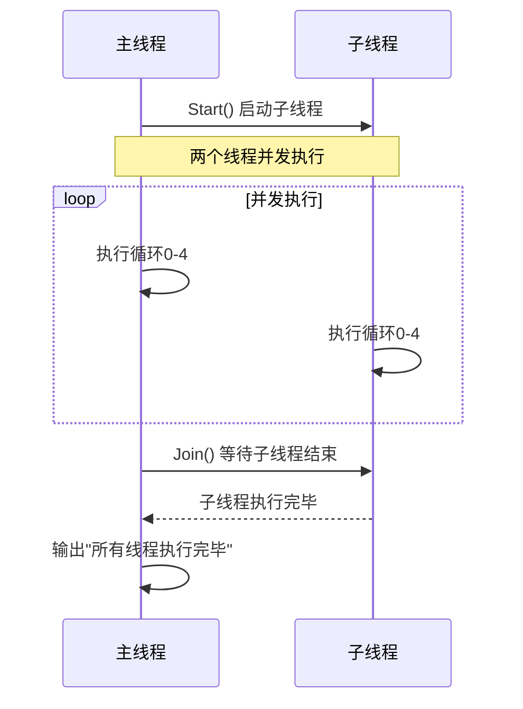
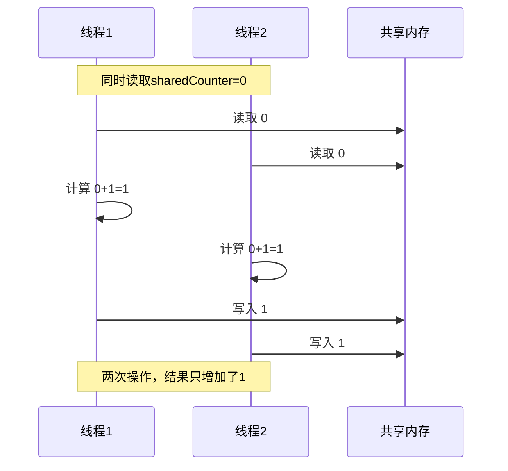
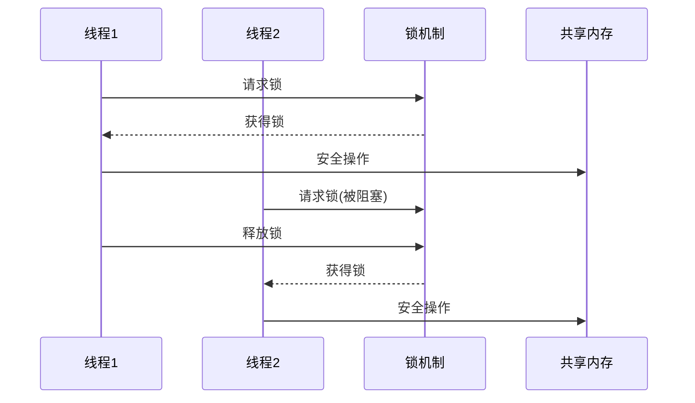
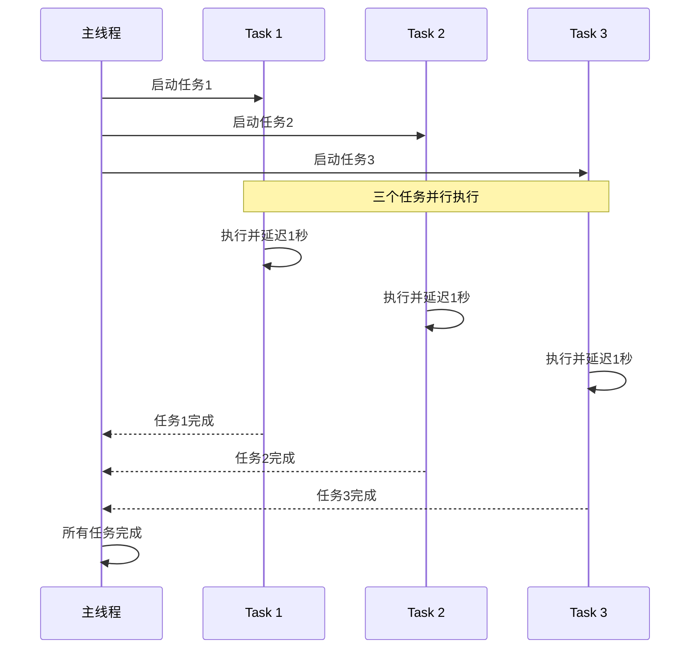
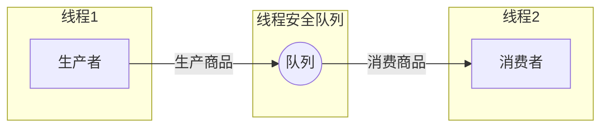

# C#多线程全面解析


**本文收录于《控制工程自学指南》上位机篇，© 2025 SAJalon**

---

## 前言

多线程编程是现代软件开发中的重要技能。在C#中，多线程能够提高程序的执行效率，充分利用多核CPU的性能。本文将通过简单易懂的案例，全面解析C#多线程编程。

## 一、基础概念详解

### 1.1 线程

*   **进程（Process）**：程序在操作系统中的一次执行实例，拥有独立的内存空间。
    
*   **线程（Thread）**：线程是进程的一部分，一个进程可以包含多个线程，每个进程最少都会拥有一个“入口线程”，也可以创建更多的线程，这些线程共享进程的资源。线程同样也是操作系统中能够独立运行的最小单位，也是程序中能够并发执行的一段指令序列。
    
*   **多线程**：将多个的、不同的、批量的、重复的任务同时执行，并互不干扰。
    
*   **线程池**：一组预先创建的线程，可以被重复使用来执行多个任务。避免了频繁的创建和销毁线程，从而减少线程创建和销毁的开销，提高系统的性能和效率。
    

### 1.2 线程安全

*   **线程安全**：多个线程访问/修改共享资源时，对共享资源的访问不会导致数据不一致或不可预期的结果。
    
*   **竞态条件**：指多个线程同时访问共享资源时，程序的执行结果依赖于线程执行的特定顺序或时机，导致程序行为不可预测的现象。
    
*   **同步机制**：用于协调和控制多个线程之间执行顺序和互斥访问共享资源，确保线程按照特定的顺序执行，避免竞态条件和数据不一致的问题。
    
*   **原子操作**：在执行过程中不会被中断的操作。不可分割，要么完全执行，要么完全不执行，没有中间状态。在多线程环境下，原子操作能够保证数据的一致性和可靠性，避免出现竞态条件和数据竞争的问题。
    

### 1.3 并发与并行

*   **并发（Concurrency）**：多个任务在同一时间段内交替执行
    
*   **并行（Parallelism）**：多个任务在同一时刻同时执行
    

### 1.4 同步与异步

*   **同步（Synchronous）**：调用方需要等待被调用方执行完毕才能继续执行
    
*   **异步（Asynchronous）**：调用方不需要等待被调用方执行完毕就能继续执行（异步编程默认使用线程池）
    

## 二、创建线程的几种方式

### 2.1 使用Thread类

```csharp
using System;
using System.Threading;

class Program
{
    static void Main()
    {
        // 创建线程
        Thread thread = new Thread(DoWork);
        
        // 启动线程
        thread.Start();
        
        // 主线程继续执行
        for (int i = 0; i < 5; i++)
        {
            Console.WriteLine($"主线程执行: {i}");
            Thread.Sleep(500);
        }
        
        // 等待子线程执行完毕
        // Join() 就是让主线程"等待"子线程执行完毕后再继续执行
        thread.Join();
        
        //thread.Join() - 无限等待
        //thread.Join(timeout) - 限时等待
        
        Console.WriteLine("所有线程执行完毕");
    }
    
    // 线程执行的方法
    static void DoWork()
    {
        for (int i = 0; i < 5; i++)
        {
            Console.WriteLine($"子线程执行: {i}");
            Thread.Sleep(800);
        }
    }
}
```

**输出结果：**

```plaintext
主线程执行: 0
子线程执行: 0
主线程执行: 1
子线程执行: 1
主线程执行: 2
子线程执行: 2
主线程执行: 3
子线程执行: 3
主线程执行: 4
子线程执行: 4
所有线程执行完毕
```

**线程执行流程图：**



### 2.2 使用Lambda表达式

```csharp
using System;
using System.Threading;

class Program
{
    static void Main()
    {
        // 使用Lambda表达式创建线程
        Thread thread = new Thread(() =>
        {
            for (int i = 0; i < 3; i++)
            {
                Console.WriteLine($"Lambda线程执行: {i}");
                Thread.Sleep(1000);
            }
        });
        
        thread.Start();
        
        thread.Join();
        Console.WriteLine("Lambda线程执行完毕");
    }
}
```

**输出结果：**

```plaintext
Lambda线程执行: 0
Lambda线程执行: 1
Lambda线程执行: 2
Lambda线程执行完毕
```

## 三、线程同步问题

### 3.1 线程安全问题演示

```csharp
using System;
using System.Threading;
using System.Threading.Tasks;

class Program
{
    static int sharedCounter = 0;  // 共享资源
    
    static void Main()
    {
        // 创建多个线程同时修改共享变量

        Thread[ ] threads = new Thread[5];

        
        for (int i = 0; i < 5; i++)
        {
            threads[i] = new Thread(() =>
            {
                for (int j = 0; j < 1000; j++)
                {
                    sharedCounter++;  // 非线程安全操作
                }
            });
            threads[i].Start();
        }
        
        // 等待所有线程执行完毕
        for (int i = 0; i < 5; i++)
        {
            threads[i].Join();
        }
        
        Console.WriteLine($"期望结果: 5000");
        Console.WriteLine($"实际结果: {sharedCounter}");
        Console.WriteLine($"差异: {5000 - sharedCounter}");
    }
}
```

**可能的输出结果：**

```plaintext
期望结果: 5000
实际结果: 4873
差异: 127
```

**线程冲突示意图：**



### 3.2 使用lock关键字解决线程安全问题

```csharp
using System;
using System.Threading;

class Program
{
    static int sharedCounter = 0;
    static readonly object lockObject = new object();  // 创建一个锁对象
    
    static void Main()
    {

        Thread[ ] threads = new Thread[5];

        
        for (int i = 0; i < 5; i++)
        {
            threads[i] = new Thread(() =>
            {
                for (int j = 0; j < 1000; j++)
                {
                    // lock语句 - 获取锁
                    lock (lockObject)  // 加锁保护临界区
                    {
                        sharedCounter++;  // 线程安全操作
                    }
                    // 离开lock块时自动释放锁
                }
            });
            threads[i].Start();
        }
        
        for (int i = 0; i < 5; i++)
        {
            threads[i].Join();
        }
        
        Console.WriteLine($"期望结果: 5000");
        Console.WriteLine($"实际结果: {sharedCounter}");
    }
}
```

**输出结果：**

```plaintext
期望结果: 5000
实际结果: 5000
```

**使用lock的同步机制：**



## 四、线程池和Task

### 4.1 使用ThreadPool

```csharp
using System;
using System.Threading;

class Program
{
    static void Main()
    {
        // 使用线程池执行任务
        for (int i = 0; i < 5; i++)
        {
            int taskNumber = i;  // 捕获循环变量
            ThreadPool.QueueUserWorkItem(ThreadPoolWork, taskNumber);
        }
        
        Console.WriteLine("主线程继续执行...");
        Thread.Sleep(3000);  // 等待线程池任务完成
    }
    
    static void ThreadPoolWork(object state)
    {
        int taskNumber = (int)state;
        Console.WriteLine($"线程池任务 {taskNumber} 开始执行");
        Thread.Sleep(1000);
        Console.WriteLine($"线程池任务 {taskNumber} 执行完毕");
    }
}
```

**输出结果：**

```plaintext
主线程继续执行...
线程池任务 0 开始执行
线程池任务 1 开始执行
线程池任务 2 开始执行
线程池任务 3 开始执行
线程池任务 4 开始执行
线程池任务 0 执行完毕
线程池任务 1 执行完毕
线程池任务 2 执行完毕
线程池任务 3 执行完毕
线程池任务 4 执行完毕
```

### 4.2 使用Task（推荐方式）

```csharp
using System;
using System.Threading.Tasks;

class Program
{
    static async Task Main()
    {
        Console.WriteLine("开始执行异步任务...");
        
        // 创建并启动多个Task

        Task[ ] tasks = new Task[3];

        
        for (int i = 0; i < 3; i++)
        {
            int taskNumber = i;
            tasks[i] = DoAsyncWork(taskNumber);
        }
        
        // 等待所有任务完成
        await Task.WhenAll(tasks);
        
        Console.WriteLine("所有异步任务执行完毕");
    }
    
    static async Task DoAsyncWork(int taskNumber)
    {
        Console.WriteLine($"任务 {taskNumber} 开始执行");
        await Task.Delay(1000);  // 模拟异步操作
        Console.WriteLine($"任务 {taskNumber} 执行完毕");
    }
}
```

**输出结果：**

```plaintext
开始执行异步任务...
任务 0 开始执行
任务 1 开始执行
任务 2 开始执行
任务 0 执行完毕
任务 1 执行完毕
任务 2 执行完毕
所有异步任务执行完毕
```

**Task执行流程：**



## 五、生产者消费者模式

```csharp
using System;
using System.Collections.Concurrent;
using System.Threading;
using System.Threading.Tasks;

class Program
{
    static ConcurrentQueue<int> queue = new ConcurrentQueue<int>();
    static bool productionComplete = false;
    
    static async Task Main()
    {
        // 启动生产者和消费者任务
        Task producerTask = Producer();
        Task consumerTask = Consumer();
        
        await Task.WhenAll(producerTask, consumerTask);
        Console.WriteLine("生产消费完成");
    }
    
    static async Task Producer()
    {
        for (int i = 1; i <= 10; i++)
        {
            queue.Enqueue(i);
            Console.WriteLine($"生产者生产: {i}");
            await Task.Delay(200);
        }
        productionComplete = true;
        Console.WriteLine("生产完成");
    }
    
    static async Task Consumer()
    {
        while (!productionComplete || queue.Count > 0)
        {
            if (queue.TryDequeue(out int item))
            {
                Console.WriteLine($"消费者消费: {item}");
                await Task.Delay(300);
            }
            else
            {
                await Task.Delay(100);  // 队列为空时短暂等待
            }
        }
        Console.WriteLine("消费完成");
    }
}
```

**输出结果：**

```plaintext
生产者生产: 1
消费者消费: 1
生产者生产: 2
消费者消费: 2
生产者生产: 3
消费者消费: 3
生产者生产: 4
消费者消费: 4
生产者生产: 5
消费者消费: 5
生产者生产: 6
消费者消费: 6
生产者生产: 7
消费者消费: 7
生产者生产: 8
消费者消费: 8
生产者生产: 9
消费者消费: 9
生产者生产: 10
生产完成
消费者消费: 10
消费完成
生产消费完成
```

**生产者消费者模式图：**



## 六、线程取消机制

```csharp
using System;
using System.Threading;
using System.Threading.Tasks;

class Program
{
    static async Task Main()
    {
        CancellationTokenSource cancellationTokenSource = new CancellationTokenSource();
        CancellationToken token = cancellationTokenSource.Token;
        
        // 启动长时间运行的任务
        Task longRunningTask = LongRunningWork(token);
        
        // 3秒后取消任务
        await Task.Delay(3000);
        // 取消（终止）线程执行
        cancellationTokenSource.Cancel();
        
        try
        {
            await longRunningTask;
        }
        catch (OperationCanceledException)
        {
            Console.WriteLine("任务已被取消");
        }
  
        Console.WriteLine("程序结束");
    }
    
    static async Task LongRunningWork(CancellationToken token)
    {
        for (int i = 0; i < 10; i++)
        {
            // 检查是否被取消
            token.ThrowIfCancellationRequested();
            
            Console.WriteLine($"任务执行中: {i}");
            await Task.Delay(1000, token);
        }
        Console.WriteLine("任务完成");
    }
}
```

**输出结果：**

```plaintext
任务执行中: 0
任务执行中: 1
任务执行中: 2
任务已被取消
程序结束
```

## 七、底层原理说明

### 7.1 线程调度原理

操作系统负责线程的调度，通过**时间片轮转**的方式让多个线程看起来是同时执行的。

### 7.2 内存模型

每个线程都有自己的栈空间，但共享堆内存。这就是为什么需要同步机制来保护共享资源。

### 7.3 上下文切换

当CPU从一个线程切换到另一个线程时，需要保存当前线程的状态并恢复目标线程的状态，这个过程称为上下文切换。

## 八、最佳实践建议

1.  **优先使用Task而非Thread**：Task提供了更好的抽象和性能
    
2.  **避免过度创建线程**：使用线程池来管理线程
    
3.  **正确使用同步机制**：避免死锁，合理使用lock
    
4.  **处理异常**：在线程中发生的异常需要特殊处理
    
5.  **考虑取消机制**：为长时间运行的任务提供取消功能